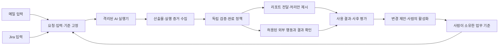

# Chun-su 방향 검토 리포트

작성일: 2026-09-05 · 반영 범위: Jira 티켓 처리, 메일 검토·요약 리포트, 프레임워크 검증 후 개발 도입. 상태: 검토 제안이며 구현 명세의 확정은 아니다.

관리 파일, 실행기 전달 방식, API 도구, 인증정보, 성공 판정과 복구 절차의 구체안은 [업무·도구·인증 상세 설계안](/Users/carlos-yang/dev/chun-su/WORKFLOW_DETAIL_DESIGN.md:1)에 정리했다. 이 리포트는 전체 방향과 검증 순서를 다룬다.

**AI 실행기를 가운데 둔 개인 프레임워크라는 방향은 목적에 부합한다. Jira 티켓 처리와 메일 검토·요약 리포트를 첫 두 워킹그룹으로 삼아 공통 구조를 검증하고, 그 다음 개발을 도입하는 순서를 권한다.** 사람이 소유한 기준, 실행기 밖의 통제, 사후 평가와 사람의 기준 갱신은 그대로 유지한다. 공통 커널의 뼈대는 초기에 두되, 실제 업무와 평가를 함께 연결하면서 필요한 기능을 완성해야 한다.

첫 구현 순서는 메일 리포트로 입력 수집부터 결과 전달까지 연결하고, Jira 처리로 업무별 판단·예외·필요한 외부 행동 경계를 검증하는 안을 제안한다. 두 업무를 먼저 지원한다는 목표는 사용자가 확인했으며, 두 업무 안에서의 구현 순서는 이번 검토의 제안이다. 개발 도입은 이 검증 이후에 둔다.

프로젝트가 축적해야 할 자산은 잘 정리된 개인의 기준, 작업에 필요한 맥락, 재사용할 작업 방식, 실제 실패에서 얻은 평가 사례다. 이 자산이 쌓이고 AI 실행기를 바꾸어도 남는다면 목적에 가까워진다. 프레임워크의 구성 요소가 늘었다는 사실만으로는 그 진전을 판단하기 어렵다.

개인 효용에는 세 가지가 있다. 같은 품질의 일을 더 적은 수고로 처리하는 것, 같은 수고로 더 좋은 결과를 얻는 것, 이전에는 하기 어려웠던 일을 가능하게 하는 것이다. 반복 업무의 첫 실험에서는 사람의 시간 절감을 가장 쉽게 측정할 수 있지만, 모든 업무의 성공을 시간 절감 하나로 제한할 필요는 없다.

**이번 판단은 현재 폴더에서 확인한 두 문서를 기준으로 한다.** [DESIGN.md](/Users/carlos-yang/dev/chun-su/DESIGN.md:1) 전체 656줄과 [IMPLEMENTATION_PLAN.md](/Users/carlos-yang/dev/chun-su/IMPLEMENTATION_PLAN.md:1) 전체 723줄을 읽고 비교했다. 설계에서 언급한 `docs/00~08`, `hermes-agent-setup.md`, 러너, 워킹그룹, 골든셋, 실행 기록은 현재 폴더에 없었다. 현재 폴더는 Git 저장소로도 확인되지 않았다. 따라서 문서의 과거 구현·검증 완료 기록은 이번에 재현한 사실로 취급하지 않았다.

외부 자료는 설계의 주요 전제를 점검하는 범위에서 보충했다. 아래에서 문서에 명시된 원칙, 사용자가 확인한 목적, 이번 검토의 제안을 구분한다. 확인된 목적은 업무상 Jira 티켓 처리와 메일 검토·요약 리포트를 반복해서 맡기는 것, AI 실행기를 중심에 둔 개인 프레임워크를 만드는 것, 개발은 프레임워크 검증 뒤에 도입하는 것이다. Jira 처리의 구체적 행동 범위, 메일 서비스, 리포트 수신 경로·빈도, 상시 무인 운영 여부는 아직 확정되지 않았다.

**핵심 원칙은 구현 수단과 분리해서 보존해야 한다.** 다음 표의 앞 두 열은 문서의 명시적 근거이고, 마지막 열은 그 원칙을 목적에 맞게 적용하는 제안이다.

| 유지할 원칙 | 문서 근거 | 방향을 바꾸어도 유지할 조건 |
|---|---|---|
| 사람이 기준과 변경 권한을 소유한다 | DESIGN 2절, D2; PLAN 4절 | 파일을 기준의 원본으로 두고 실행마다 버전을 고정한다. AI는 변경안을 작성할 수 있지만 활성화는 사람이 결정한다. |
| AI가 허용된 범위에서 작업을 수행한다 | DESIGN 2절, D1 | 매 턴의 임의 교정을 기본 흐름에 넣지 않는다. 권한·예산·재시도 범위를 먼저 정한다. |
| 통제는 실행기 밖에서 강제한다 | DESIGN D4, D10, D11 | 기준 수정과 허용되지 않은 외부 행동을 권한으로 차단하고, 완료 판단은 독립된 검사와 정책으로 결정한다. |
| 품질을 만드는 기준, 최소 검증, 사후 평가를 구분한다 | DESIGN 2절, D3; PLAN 2.3절 | 게이트 통과를 실제 품질과 동일시하지 않는다. 운영 결과와 평가가 다음 기준 버전의 근거가 된다. |
| 하네스를 얇게 유지한다 | DESIGN 2절, D8 | 모델의 사고 절차를 일일이 지시하는 코드를 늘리지 않는다. 반복 사용에 필요한 경계와 기록부터 만든다. |
| 실행기가 바뀌어도 개인의 자산이 남는다 | DESIGN D9; PLAN 2.1절 | 기준·사례·산출물·평가 이력을 이식할 수 있게 한다. 특정 실행기의 내부 구조를 핵심 설계에 결합하지 않는다. |

컨테이너, 상시 서비스, SQLite, 비동기 어댑터, 계약의 개수는 이 원칙을 실현하는 수단이다. 이 가운데 무엇이 처음부터 필요한지는 실제 작업과 운영 조건으로 판단할 수 있다. 반면 기준의 소유권과 실행기의 권한 경계는 초기 실험에서도 빠뜨려서는 안 된다.

**현재 문서에는 유지할 만한 개선과, 아직 효용이 확인되지 않은 확장이 함께 있다.** 최신 구현 계획은 원래 설계의 불필요한 승인과 몇 가지 무결성 혼동을 잘 정리했다. 재시도 후 통과를 무조건 사람에게 보내지 않는 점, 실행 당시의 정책과 입력을 고정하는 점, 운영 피드백과 골든 정답을 구분하는 점은 채택할 가치가 높다. [구현 계획의 명시적 수정 목록](/Users/carlos-yang/dev/chun-su/IMPLEMENTATION_PLAN.md:377)

그러나 현재 순서는 계약 확정 → 상시 커널 → 실제 AI 작업 → 평가와 개선이다. 특히 Phase 1에서 큐, 리스, 복구, 여러 확장 인터페이스를 먼저 만들고, 사용자의 중요한 원칙인 기준 개선 루프는 Phase 3에 도착해서야 완성된다. 개인에게 어느 업무가 얼마나 도움이 되는지 배우기까지의 거리가 길다. [단계별 계획](/Users/carlos-yang/dev/chun-su/IMPLEMENTATION_PLAN.md:335)

공통 커널을 둘 근거는 구체적이다. 메일과 Jira는 모두 업무 입력을 수집하고, 개인 기준을 적용해 AI에 맡기고, 결과를 확인하고, 이력을 남겨야 한다. 두 실제 업무가 확인됐으므로 입력·실행·검증·기록 경계를 처음부터 공유하는 것이 타당하다. 다만 이 필요성이 다중 작업자나 범용 워크플로 엔진까지 정당화하지는 않는다. 어떤 상태와 인터페이스가 공통인지는 두 업무를 연결하며 확인해야 한다. 이는 원래의 작은 커널 구상과도 맞는다. [DESIGN D8](/Users/carlos-yang/dev/chun-su/DESIGN.md:124)

또한 “품질은 앞이 만든다”는 원칙에 비해 로드맵의 무게는 실행을 관리하는 구조에 실려 있다. 실제 실패가 관련 맥락 부족, 모호한 지시, 부적절한 예시에서 생긴다면 커널을 더 정교하게 만드는 것만으로 결과는 좋아지지 않는다. 기준과 맥락을 작성하고 유지하는 사람의 시간까지 측정해야 한다.

**권장하는 초기 제품 경험은 짧게 요청하고, 결과와 예외를 확인하며, 유용한 기준을 누적하는 흐름이다.** 사람은 첫 설정에서 메일·Jira 각각의 대상 범위, 좋은 결과의 예, 허용 행동을 정하고, 반복 실행에서는 달라진 조건만 제공한다. 작업별 기준 묶음은 현재 `workgroup` 개념을 그대로 활용할 수 있다. AI는 티켓이나 메일을 해석하고 작업을 수행하며, 바깥의 프레임워크는 무엇을 맡겼고 어떤 결과가 확인됐는지를 책임진다.

완료 화면에는 결과물, 검증된 범위, 확인이 필요한 부분, 필요한 경우 근거를 보여주면 된다. 해시·상태 전이·전체 로그는 원인을 조사할 때 접근할 수 있는 기록으로 남긴다. 사람이 평소에 시스템 내부를 해석해야 한다면 워크플로우 자체가 새로운 일이 된다.

| 문서의 결정 또는 확장 항목 | 권고 | 이유와 적용 방식 |
|---|---|---|
| 파일로 관리하는 기준과 실행별 스냅샷 | 유지 | 개인 자산의 소유권과 변경 추적에 직접 기여한다. |
| 하나의 격리된 실행기와 독립 게이트 | 유지 | 첫 실험에서도 권한과 완료 판단을 분리해야 한다. 검증 가능한 기존 격리 수단을 활용한다. |
| 평가와 사람의 변경 승인 | 첫 실제 실행부터 포함 | 작은 사례 묶음과 수동 비교로 시작해도 된다. 평가 서비스의 완성까지 기다릴 필요가 없다. |
| 공통 커널과 실행 상태 | 초기 범위에 포함 | 메일·Jira가 같은 방식으로 접수·실행·검증·기록되게 한다. 중단 상태와 실행 이력을 보존한다. |
| 상시 운영·큐·리스·다수 확장 포트 | 필요한 운영 수준에 맞춰 확대 | 반복 업무에 필요한 간단한 시작·재개 기능부터 검증한다. 다중 작업자와 분산 운영은 뒤로 둔다. |
| 업무별로 공통 파이프라인 적용 | 메일·Jira에서 먼저 검증 | 바깥의 권한과 기록 경계를 공유하되 산출물·완료 조건은 업무별로 둔다. 개발의 내부 실행·검증은 이후에 추가한다. |
| PLAN의 자유 형식 `must` 제외 | 강제 조건과 품질 요청을 구분해 설명 | 금지 행동과 필수 형식은 구조화한다. “이번에는 짧게”, “대안을 함께 설명” 같은 요청은 기존 지시문 필드로 받고, 의미 판단이 필요한 범위를 표시한다. |
| DESIGN D9의 실행기 비교·프롬프트 설계 제외 | 내부 결합은 피하되 성능 비교는 허용 | PLAN이 도입한 벤치마크 방향을 따른다. 같은 실제 작업에서 비용과 품질을 비교하고, 기준·예시·도구 설명의 개선도 품질 투자에 포함한다. |
| 실패할수록 규칙의 강제 수준을 높임 | 원인에 따라 수정·추가·삭제 | 누락된 맥락을 주거나 충돌하는 규칙을 없애는 편이 나을 수 있다. 규칙 수 자체는 성과가 아니다. |
| 메모리 자동 갱신 차단 | 활성 기준에 대한 차단 유지 | 과거 사실·작업 기록과 규범적 기준을 구분한다. 필요한 지식은 출처와 버전을 붙여 입력으로 제공할 수 있다. |
| Phase 4에 배치한 선택적 AgentCore 연동 | 도입 조건을 명시 | 로컬 운영 부담이나 원격 실행 수요가 생겼을 때 비교한다. 개인 기준과 평가 기록의 소유권은 유지한다. |

규칙 원본의 중복은 피하되, 실행기에 전달하는 설명은 필요한 만큼 이해하기 쉽게 구성할 수 있다. 기준 파일의 읽기 권한만 준 것으로 그 기준이 실제 맥락에 들어갔다고 보장할 수는 없다. 어떤 기준과 입력을 전달했는지는 실행 기록에 남기고, 부족하거나 충돌하는 맥락은 품질 문제의 원인으로 조사할 수 있어야 한다.

**메일 워킹그룹의 목표는 검토 결과를 요약한 리포트를 받는 것이다.** 기존 `email-triage`의 라벨 분류는 이 흐름 안의 일부로 활용할 수 있다. 제품의 완료 조건에는 무엇을 확인했고, 무엇이 중요하며, 사용자가 다음에 무엇을 해야 하는지가 포함되어야 한다.

추천 리포트는 이번 검토에서 대응할 항목, 요청·기한·회신 필요 여부, 이전 리포트 이후 바뀐 내용, 참고 사항, 확인하지 못한 범위를 담는다. 각 항목에는 원문 메일 또는 스레드로 돌아갈 근거를 붙인다. 원문에 없는 기한과 의도를 사실처럼 확정하지 않고, 추정과 확인 필요 사항을 구분한다. 이는 초안 제안이며 정확한 구성은 실제 리포트를 보고 조정할 수 있다.

| 메일 흐름의 단계 | 프레임워크가 책임질 것 | 업무 기준과 평가가 책임질 것 |
|---|---|---|
| 수집 | 계정·폴더·기간 등 선택 범위, 수집 시각, 원문 식별자, 실패·누락 범위 기록 | 어떤 메일과 과거 스레드가 검토에 필요한가 |
| 검토·요약 | 해당 실행의 입력과 기준을 고정해 실행기에 전달 | 중요한 요청을 알아보는가, 새 답변이 과거 내용을 바꿨는가 |
| 검증 | 존재하는 원문에 연결되는가, 수집한 항목이 요약·참고·제외 중 어디에 처리됐는가 | 중요한 내용이 요약에서 빠졌는가, 요약이 원문의 의미를 보존하는가 |
| 전달 | 리포트 생성과 수신 경로에서의 제공·전달 성공을 구분해 기록 | 사용자가 이 리포트로 실제 판단과 대응을 할 수 있는가 |

수집 실패를 “새 메일 없음”으로 보고하거나, 원문 식별자가 있다는 이유만으로 요약의 사실성이 확인됐다고 판단해서는 안 된다. 전체 스레드를 받지 못했다면 그 한계도 표시한다. 초기 목적에는 메일 발송·삭제·읽음 상태 변경이 포함되어 있지 않다. 리포트의 수신 경로와 빈도는 별도로 정하되, 로컬 파일 생성만으로 사용자가 리포트를 받았다고 처리하지 않는다.

**Jira 워킹그룹은 티켓을 읽는 단계와 실제로 처리하는 단계를 연결할 수 있어야 한다.** 다만 사용자가 말한 “처리”가 다음 중 어디까지인지 아직 확정되지 않았으므로, 요약만으로 요구가 충족됐다고 가정하거나 댓글·상태 변경을 자동화 대상으로 확정하지 않는다.

| 처리 범위 | AI 산출물 또는 행동 | 완료를 확인할 증거 |
|---|---|---|
| 티켓 검토·처리 제안 | 요구사항, 최근 변경, 막힌 이유, 다음 행동과 근거 | 현재 티켓 맥락과 일치하며 실제로 사용할 수 있는 처리안 |
| Jira 안의 업무 처리 | 댓글 초안, 담당자·필드·상태 변경안과 허용된 반영 | 승인된 변경 내용과 Jira에서 관찰한 결과가 일치 |
| 티켓이 요구한 실무 수행 | 조사 결과, 문서, 요청된 업무의 산출물 | 해당 업무의 완료 조건을 충족한 결과물과 필요시 Jira 반영 기록 |

코드 변경이 필요한 티켓은 개발 도입 전까지 분류와 처리 제안 범위에 둔다. 티켓 상태를 바꾼 사실과 티켓이 요구한 실무를 끝낸 사실은 구분한다. 외부 행동 범위가 확정되기 전에도 입력 수집, 처리안 작성, 독립 검증, 결과 기록과 평가 구조는 설계할 수 있다.

외부 변경을 포함하게 되면 실행기는 대상 티켓, 현재 값, 바꿀 값 또는 댓글, 근거를 담은 변경안을 먼저 만든다. 프레임워크는 사람이 정한 정책에 따라 바로 반영 가능한 것과 확인이 필요한 것을 구분하고, 실행기 밖의 도구가 실제 변경을 수행한 뒤 결과를 확인한다. 사람의 승인까지 오래 걸려 원문이 바뀌었으면 해당 변경안이 여전히 유효한지 다시 확인해야 한다. 재시도는 AI의 처리안 재생성과 외부 변경의 재전송을 구분한다.

최신 티켓을 다시 읽는 것만으로 읽기와 변경 사이의 동시 수정까지 방지할 수 있는 것은 아니다. 버전 조건을 붙인 변경이 가능한지, 충돌을 어떻게 감지하고 보류할지는 실제 커넥터에서 확인해야 한다. 여러 티켓 중 일부만 성공했다면 전체를 완료로 기록하지 않고 건별 결과를 남긴다.

Jira Cloud의 상태 전이는 티켓에 가능한 전이와 사용자 권한을 확인하는 API 흐름을 제공한다. 따라서 상태 이름 하나를 모든 프로젝트의 고정 규칙으로 넣어서는 안 된다. 또한 검색은 쓰기 직후 최신 결과를 보장하지 않을 수 있어, 검색 결과에 변경이 안 보인다는 이유만으로 같은 행동을 다시 실행하면 안 된다. 외부 반영의 확인 방법은 사용하는 Jira 종류와 커넥터에 맞춰 검증해야 한다. [Jira Cloud Issues API](https://developer.atlassian.com/cloud/jira/platform/rest/v3/api-group-issues/), [Search and Reconcile](https://developer.atlassian.com/cloud/jira/platform/search-and-reconcile/)

**두 업무에서 공통으로 필요한 기능이 개인 프레임워크의 초기 범위가 된다.** 다음 경계를 작게 구현하면 개발 도입 때도 기준·기록·평가 체계를 재사용할 수 있다.

| 공통 기능 | 초기에 필요한 이유 | 업무별로 남길 부분 |
|---|---|---|
| 입력 커넥터와 출처 기록 | 어떤 메일·티켓을 언제 읽었는지 추적 | 계정·프로젝트·검색 조건, 스레드·댓글·첨부 수집 방식 |
| 기준 버전과 실행 패키지 | 같은 작업 중 기준이 바뀌거나 다른 업무의 권한이 섞이는 것 방지 | 우선순위·요약 기준, Jira 처리 규칙, 각 산출물 형식 |
| 실행·수집·기록 | 실행기 교체와 제한된 재시도, 실패 원인 확인 | 내부 작업 절차와 허용 도구 |
| 독립 검증과 완료 정책 | 결과 생성, 사용자 전달, 외부 반영의 상태 구분 | 메일 리포트의 최소 조건, Jira 처리 유형별 완료 조건 |
| 검토 대기와 전달 | 사람이 봐야 할 예외와 결과를 놓치지 않게 함 | 리포트 수신 경로, Jira 변경 승인과 반영 방식 |
| 사후 평가와 기준 갱신 | 좋은 결과를 만드는 기준을 사람의 판단으로 개선 | 업무별 골든셋·평가 기준·오류 심각도 |

메일·티켓의 본문은 검토 대상 데이터다. 본문에 다른 작업 지시나 권한 확대 요구가 적혀 있다는 이유로 개인의 활성 기준과 실행 권한이 바뀌어서는 안 된다. 필요한 추가 정보는 미리 허용한 읽기 도구로 가져오고 출처를 기록한다. AI의 업무 판단과 프레임워크의 권한 결정 경계를 여기서 유지한다.

반복 실행에서는 “자료를 수집한 위치”, “결과를 만든 위치”, “사용자에게 제공한 위치”를 구분해 기록해야 한다. 리포트 전달이 실패했는데 수집 진행 위치만 앞으로 이동하면 다음 실행에서 그 메일을 놓칠 수 있다. 반대로 전체 작업을 무조건 다시 시작하면 동일 리포트나 Jira 변경이 반복될 수 있다. 처리한 입력의 식별자·버전과 단계별 상태를 남기고, 실패한 단계에서 재개하거나 결과를 대조할 수 있게 한다. 외부 행동의 성공 여부를 확인할 수 없으면 확인 대기로 남기며 정확히 한 번 실행을 보장한다고 주장하지 않는다.

**개발은 두 업무로 프레임워크가 검증된 뒤에 도입하는 것이 사용자 목적에 맞다.** 개발을 넣을 때 추가로 확인할 부분은 코드 작업 환경, 직접 관련된 검증 명령, 변경 파일의 수집과 검토, 코드 변경을 반영하는 권한이다. 초기 커널에 개발 절차를 미리 구현할 필요는 없다. 메일과 Jira에서 공유한 입력·실행·산출물·완료·평가 경계를 개발 워킹그룹에도 적용할 수 있는지 그 시점에 검증한다.

**최소 구현은 메일 한 업무로 전체 루프를 연결하고, 같은 구조에 Jira를 얹어 공통성을 확인하는 순서가 적합하다.** 필요한 것은 작업 기준 한 묶음, 짧은 요청, 고정된 입력과 기준 버전, 격리된 실행 한 번, 결과 수집, 독립된 최소 검증, 정책에 따른 종료와 제한된 재시도, 사용자의 수정·평가 기록이다. 기준 변경안 한 건을 사람이 검토하고 새 버전으로 다시 실행하는 과정까지 포함한다. Jira를 추가할 때 메일 흐름을 다시 작성해야 한다면 공통 경계를 재검토한다.

처음부터 다양한 저장소·알림·지식 제공자 인터페이스를 만들 필요는 없다. 결과를 받는 실제 경로 하나와 실행 상태의 영속성은 초기 범위에 포함한다. 중단된 작업을 완료로 오인하거나 기록 없이 재실행해서는 안 된다. 고정 입력의 검토·초안 단계에서는 중단을 표시하고 새 시도로 다시 실행하는 정책을 둘 수 있다. Jira 변경과 리포트 외부 전달이 포함되는 단계에서는 이미 발생한 효과를 먼저 대조하고 재개해야 한다. 상시 프로세스의 운영 방식과 자동 재개 수준은 실제 반복 주기에 맞춰 정한다.

**성공 여부는 현재 AI 사용 방식과 비교해야 한다.** 수작업만을 비교 대상으로 삼으면 기존 AI 도구만으로도 얻을 수 있는 이득을 Chun-su의 효과로 착각할 수 있다.

1. 실제 사용하는 방식의 준비·검토·수정 시간과 결과 품질을 기록한다.
2. 같은 입력, 모델 버전, 허용 도구와 예산 범위에서 Chun-su 흐름을 실행한다. 달라지는 기준·맥락·검증 방식도 기록한다.
3. 결과를 가능하면 어느 방식의 것인지 가리고 평가하고, 실제 사용 가능 여부와 필요한 수정을 남긴다. 두 번째로 읽어서 빨라지는 효과가 섞이지 않도록 순서를 바꾸거나 별도 배치에서 확인한다.
4. 실패 원인을 분류하고 기준 변경 한 가지를 제안한다. 사람의 승인 뒤 이전 사례와 별도로 남겨둔 사례에서 다시 확인한다.
5. 다음 실제 유입 배치에서도 이득이 남는지 확인한 뒤 운영 기능을 확장한다.

이 비교는 워크플로우 전체의 효용을 보는 실험이다. 특정 프롬프트나 게이트 하나가 개선의 원인이라고 단정할 수는 없다. 원인 구분이 필요할 때 해당 요소만 바꾸는 후속 비교를 한다.

초기 표본은 예를 들어 실제 사례 20~30건에서 시작할 수 있다. 이는 실행 가능한 출발 규모 제안이며 정확도나 안전성을 입증하는 표본 수가 아니다. 평범한 유입과 애매한 사례를 함께 넣고, 기준을 고칠 때 계속 보는 사례와 최종 확인용 사례를 구분한다. 같은 스레드의 유사 메일이 양쪽에 들어가 평가가 쉬워지는 것도 피한다.

| 측정할 것 | 기록 방법 | 판단에 쓰는 이유 |
|---|---|---|
| 실제 사용 가능 결과 | 그대로 사용 / 소폭 수정 / 큰 수정 / 폐기. 구분 기준을 먼저 정한다 | 형식 통과가 실제 효용으로 이어지는지 확인 |
| 사람의 전체 투입 시간 | 요청 준비, 확인, 수정, 예외 처리, 기준 유지 시간을 합산 | 자동화가 일을 다른 단계로 옮기기만 하는지 확인 |
| 중요한 오류와 누락 | 오류 유형·심각도·발견 경로를 기록 | 평균 점수에 가려지는 문제 확인 |
| 사람에게 넘어오는 비율 | 전체 건수 대비 확인 요청, 재시도 소진, 사용자의 재작업 | `unknown` 남발이나 과도한 승인으로 생기는 부담 확인 |
| 사용 가능한 결과당 비용 | 실패·재시도·평가 비용까지 포함한 전체 비용을 실제 사용 가능 건수로 나눔 | 토큰 절감과 실제 경제성을 구분 |
| 첫 시도와 최종 결과 | 최초 결과, 재시도 횟수, 최종 품질을 각각 기록 | 재시도에 가려진 불안정성과 비용 확인 |

주된 판단식은 다음과 같다. 기다리는 시간과 사용료는 사람의 작업 시간과 별도로 함께 기록한다.

> 순절감 시간 = 기존 방식의 사람 투입 시간 − 새 방식의 준비·검토·수정·예외 처리·기준 유지 시간 − 초기 구축·설정 시간의 배분분

시간 절감이 목적인 업무에서는 원하는 품질과 허용할 오류의 종류를 먼저 정하고, 그 조건 아래 순절감 시간이 지속적으로 양수인지 본다. 구축 비용을 회수하는 데 필요한 반복 횟수도 실제 사용 빈도와 비교한다. 품질 향상이나 새로운 작업 수행이 목적이라면 그 개선을 별도로 판정하고, 추가 시간과 비용을 감수할 가치가 있는지 사람이 판단한다. 사람에게 넘기는 비율을 낮추려고 오류를 숨기거나, 자동 처리가 목적인데 모든 건을 사람에게 넘기는 흐름은 실패로 보아야 한다.

**평가는 초기에 시작하되, 사람의 유지 부담까지 관리해야 한다.** 운영 중의 모든 결과를 같은 깊이로 채점할 필요는 없다. 실패·예외 사례와 평범한 완료 사례의 표본을 함께 검토하고, 이미 알려진 문제를 확인하는 골든셋은 별도로 재실행한다. 실패 사례만 쌓인 골든 점수로 전체 유입의 품질을 추정하지 않는다. 통과한 결과만 평가해서도 전체 작업의 실패율을 알 수 없다.

AI가 실패를 묶고 변경 초안을 만들게 하되, 제안에는 관찰된 사례, 추정 원인, 변경 내용, 예상 이득, 이전 사례의 퇴행 여부가 함께 있어야 한다. 사람은 이 근거로 변경을 채택하거나 기각한다. 점수가 올랐다는 이유만으로 활성 기준을 바꾸지 않는 현재 원칙을 유지한다.

**원칙의 표현 몇 가지는 과도한 보장을 만들지 않도록 다듬는 것이 좋다.** 다음은 실제 구현에서 발생한 결함을 확인한 목록이 아니라, 문서의 주장과 제안된 강제 수단 사이의 검토 결과다.

| 문서의 표현 또는 설계 | 검토 결과 | 반영할 방향 |
|---|---|---|
| PATH에 없는 도구는 호출할 수 없다 | PATH는 명령 탐색 경로다. 다른 위치의 실행 파일이나 런타임의 직접 네트워크 호출까지 막지는 않는다 | 컨테이너의 실제 마운트·프로세스 권한·네트워크 경계와 호스트 도구의 요청 검증으로 설명한다. |
| 실행기 내부 셔틀이 `out/tool.log`를 쓰고 실행기는 못 쓴다 | 같은 쓰기 영역과 실행 주체를 전제로 하면 로그의 권위가 성립하는지 불명확하다 | 호스트 도구가 수신·실행한 호출 기록을 권위 있는 증거로 보존한다. |
| `confidence`가 불확실성을 통제 가능한 것으로 바꾼다 | 모델이 쓴 숫자를 검사하는 것으로 확신의 정직함까지 보장되지는 않는다 | 보정이 확인되기 전에는 보조 신호로 쓴다. 근거 부족·정보 충돌 같은 조건과 실제 오분류를 함께 평가한다. |
| evidence 필드가 있으면 판단 근거를 확인할 수 있다 | 필드의 존재와 인용의 정확성, 그 근거가 결론을 지지하는지는 서로 다른 문제다 | 기계로 확인할 부분과 사람 또는 평가자가 의미를 확인할 부분을 명시한다. |
| 같은 사례 세 번의 점수 편차는 rules/rubric 모호함이다 | 모델 변동, 입력·도구 변화, 실행 환경도 원인이 될 수 있다 | 버전을 고정한 반복 확인과 원인 분류 후 수정한다. 반복 횟수만으로 기준을 바꾸지 않는다. |
| 양 끝 통제만 있으면 충분하다 | 초기의 읽기·초안 작업에는 잘 맞는다. 발송·삭제처럼 이미 일어난 효과는 종료 게이트로 되돌릴 수 없다 | 외부 효과 직전의 실행기 밖 권한 확인과 필요한 승인 경계를 유지한다. 이는 PLAN Phase 5에도 포함된 방향이다. |

Docker 공식 문서 역시 격리를 네임스페이스, 권한, 마운트와 설정의 문제로 설명하고, 구성에 따라 격리가 불완전할 수 있음을 명시한다. 따라서 컨테이너 사용 여부와 실제 권한 경계가 충족됐는지를 구분해야 한다. [Docker Engine security](https://docs.docker.com/engine/security/)

또한 “프롬프트로 통제하지 않는다”는 원칙과 품질을 위한 좋은 지시·예시·도구 설명은 양립할 수 있다. 강제해야 할 권한을 프롬프트에 맡기지 않으면서, AI가 작업을 잘 수행하도록 맥락을 개선하면 된다. 실행기가 허용된 작업 안에서 도구 결과를 읽고 스스로 수정하는 것도 유지할 수 있다. 외부 커널이 매 턴 임의로 사고 방향을 교정하는 흐름을 기본값으로 만들 필요는 없다.

**외부 자료는 얇은 구조와 빠른 평가를 지지하지만, 특정 하네스의 열등함을 일반 법칙으로 확정해주지는 않는다.** 출처와 적용 범위를 다음처럼 정리한다.

| 확인한 자료 | 확인한 내용과 이 프로젝트에 대한 해석 |
|---|---|
| [Anthropic, Building effective agents](https://www.anthropic.com/engineering/building-effective-agents), 2024-12-19 | 단순한 해법에서 시작하고 개선이 입증될 때 복잡도를 늘리라고 권한다. 명확한 기준과 측정 가능한 이득이 있는 반복 개선도 유효한 패턴으로 다룬다. 모든 중간 피드백이 무익하다는 근거로 쓸 수는 없다. 현재 페이지도 당시 도구 환경이 변했음을 명시하므로 제품 비교 근거로 사용하지 않았다. |
| [Anthropic, Demystifying evals for AI agents](https://www.anthropic.com/engineering/demystifying-evals-for-ai-agents), 2026-01-09 | 실제 결과, 반복 실행의 변동, 균형 잡힌 사례, 코드·모델·사람 평가의 역할을 강조한다. 소규모 실제 사례로 평가를 일찍 시작하는 근거다. Chun-su의 평가 구현을 뒤로 미루지 말자는 판단과 부합한다. |
| [Weinberger·Hozez, Prompt-Induced Waste in Coding Agents, v5](https://arxiv.org/abs/2608.01347v5), 2026-08-24 | 확인한 초록은 프롬프트·추론 강도·하네스가 상호작용하고, 추가 노력이 어려운 작업에 도움이 되기도 하지만 비용만 늘리기도 한다고 정리한다. 성공당 전체 비용을 측정하자는 방향을 뒷받침한다. 사전 공개 논문이며 이번에는 실험 전체를 재검증하지 않았다. |
| [AWS, AgentCore harness vs. Runtime](https://docs.aws.amazon.com/bedrock-agentcore/latest/devguide/harness-vs-runtime.html), 2026-09-05 확인 | Runtime은 실행 인프라를, harness는 관리형 에이전트 루프를 제공한다. 무엇을 교체하는지 먼저 구분해야 한다. 기존 커널과 같은 기능을 다시 만드는 선택인지 검토한 뒤 도입할 수 있다. |
| [AWS, AgentCore Evaluations](https://docs.aws.amazon.com/bedrock-agentcore/latest/devguide/evaluations.html), 2026-09-05 확인 | 문서는 LLM-as-a-Judge 기반 평가를 설명한다. Chun-su가 요구하는 결정적 완료 게이트와 동일한 권위로 취급할 수 없다. |
| [AWS, AgentCore Optimization](https://docs.aws.amazon.com/bedrock-agentcore/latest/devguide/optimization.html), 2026-09-05 확인 | 변경 추천, 버전된 구성 묶음, A/B 실험을 제공한다. 이를 이용하더라도 변경 제안과 사람의 활성화 결정은 분리할 수 있다. 서비스 채택 자체가 기준의 인간 소유와 충돌하는 것은 아니다. |

DESIGN의 “토큰 5배, 품질 1.1배”에는 논문명·실험 조건이 없고, 이번 검색에서도 그 수치에 일치하는 원문을 특정하지 못했다. 위 논문이 설계에서 지칭한 논문이라고 확인한 것도 아니다. 이 수치와 “모델이 강해질수록 하네스 교정의 효용이 떨어진다”는 일반화는 검증 전 가설로 내려두는 것이 좋다. 불필요한 개입을 줄이려는 원칙은 자신의 업무에서 품질·비용·사람 시간을 비교하는 방식으로 계속 검증할 수 있다.

**진행 순서는 다음처럼 바꾸는 것을 권한다.** 달력상의 일정 대신 다음 단계로 넘어갈 증거를 기준으로 삼는다.

| 순서 | 할 일 | 다음 단계로 넘어갈 증거 |
|---|---|---|
| 1 | 공통 커널의 권한·입력·실행·완료·기록 경계와 메일 리포트의 조건을 함께 정함 | 메일·Jira에서 공유할 것과 업무별로 달라질 것을 설명할 수 있고, 초기 상태 기록과 기준 소유권이 명확함 |
| 2 | 메일 수집 → 검토 → 요약 → 검증 → 리포트 제공과 사후 평가 연결 | 중요한 메일·요청·기한의 누락을 평가하고, 수집 실패와 새 메일 없음을 구분하며, 사용자가 리포트를 확인할 수 있음 |
| 3 | 확정된 처리 범위에 맞춰 Jira 워킹그룹 추가 | 같은 실행·기록 구조를 사용하고, 티켓 처리안의 품질과 필요한 외부 반영의 결과를 별도로 확인할 수 있음 |
| 4 | 두 업무의 반복 운영과 기준 변경 검증 | 실제 사용의 이득, 중단·재시도·전달 실패의 처리, 기준 변경 전후의 품질이 확인됨. 외부 행동이 있으면 중복·오래된 변경안도 처리할 수 있음 |
| 5 | 개발 워킹그룹 도입 | 공통 구조를 유지하면서 코드 작업 환경·검증·변경 검토를 추가하고, 기존 메일·Jira 동작이 유지됨 |

메일 또는 Jira에서 선택한 효용이 확인되지 않으면 입력 준비, 결과 확인 방식, 기준의 복잡도, 실행기 적합성을 먼저 조사한다. 처리 범위를 더 좁히거나 관련 맥락을 보충한 뒤 다시 비교한다. 공통 프레임워크라는 목표를 유지하면서도 각 업무에 필요한 구조는 줄일 수 있다. 규칙과 권한을 제대로 전달했는데도 품질이 낮다면 같은 실행기 내부를 계속 교정하기 전에 다른 모델·실행기와 동일 사례로 비교할 수 있다.

플랫폼 확장은 구체적인 계기가 있을 때 한다. 사용자가 자리를 비운 동안 반복 실행해야 하고 중단 복구가 필요하면 상시 커널을, 원격 운영과 환경 관리가 부담이면 관리형 Runtime을, 두 번째 실행기의 이득이 확인되면 어댑터를 추가한다. 외부 발송·삭제·배포가 실제 업무에 들어오면 그 행동 직전의 승인과 중복 실행 방지를 별도로 설계한다.

**다음 설계 수정에서는 문서의 역할과 완료 기준부터 맞추면 된다.** DESIGN은 현재 자신을 원본으로 선언하지만, 최신 PLAN은 그 결정을 일부 바꾸는 제안이다. 어느 변경이 채택됐는지 아직 표시되어 있지 않다. 원칙·채택된 결정·실험 가설을 구분하고, 오래된 해시 비교나 재시도 후 무조건 보류 규칙이 다시 구현에 섞이지 않게 해야 한다.

프레임워크의 첫 검증 완료 기준은 “메일과 Jira가 같은 실행·기록 경계를 통해 실제로 쓰이고, 업무별 완료 조건과 평가가 작동하며, 중단·실패·사람 확인과 기준 변경을 설명 가능한 증거로 처리한다”이다. 한 번 잘된 예제만으로 개발을 추가하지 않는다. 두 업무의 반복 사용과 기준 변경 결과를 확인한 뒤 개발 도입으로 넘어간다. 사용 범위에 없는 Jira 외부 변경까지 검증 완료 조건에 억지로 넣을 필요는 없지만, 그 경우 외부 행동 경계는 아직 검증하지 않았다고 남긴다.

**이번에 실행한 확인은 문서 전수 읽기, 현재 파일 목록과 Git 상태 확인, 두 설계의 차이 비교, 공식 문서 및 관련 논문 초록의 출처 확인, 사용자가 확인한 두 업무를 기준으로 한 재검토다.** 실제 Jira·메일 계정 조회나 변경, AI 작업의 성능 비교, 격리·복구 검증, 기존 테스트는 실행하지 않았다. 현재 폴더에 해당 구현과 테스트가 없고, 새 테스트 코드도 만들지 않았다. 기존 설계 문서는 수정하지 않았으며 이 리포트만 갱신했다. 제안 방향의 개인 효용은 아직 실험으로 입증되지 않았다. 후속 구현에서 남은 결정은 Jira 처리의 행동 범위, 사용하는 Jira·메일 환경, 리포트 수신 경로·빈도, 좋은 결과의 판정 기준과 사람의 개입 예산이다.
