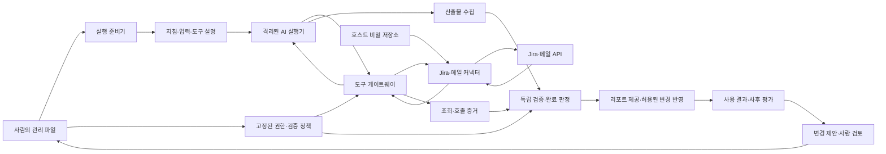

# Chun-su 업무·도구·인증 상세 설계안

작성일: 2026-09-05. 대상: Jira 티켓 처리와 메일 검토·요약 리포트. 아래 파일 구조·도구·명령·계약은 구현을 위한 제안이며, 아직 존재하거나 동작하는 기능이 아니다. 실제 Jira 종류와 메일 서비스, Jira 변경 권한의 범위는 미확정이다.

**사람은 작업 기준과 권한을 관리하고, 프로그램은 그 기준을 실행 가능한 작업 환경으로 만들며, AI 실행기는 그 안에서 필요한 판단과 도구 사용을 맡는다.** 지침, 실행 상태, 연결 설정, 비밀정보를 서로 다른 저장 영역에 두고 실행마다 필요한 지침과 입력만 전달하는 구조를 권한다. Jira·메일 API 호출은 호스트의 커넥터가 담당하고, 실행기는 허용된 도구를 통해 요청한다.

이렇게 하면 AI가 매번 API 클라이언트와 인증 처리를 새로 작성하지 않아도 되고, 프레임워크도 메일을 읽는 사고 순서나 티켓을 해석하는 판단까지 코드로 고정하지 않아도 된다.

**게이트웨이 앞단의 관리 파일은 두 경로로 사용한다.** 실행 준비기는 원본에서 실행기용 설명과 작업 묶음을 만들고, 도구 게이트웨이와 결과 검증기는 같은 버전에서 권한·검사 정책을 읽는다. 게이트웨이는 도구 호출의 출입구이며, 지침 전달은 실행 준비기의 책임이다. 초기에는 이들을 한 호스트 프로그램의 모듈로 구현할 수 있다.



외부 변경 반영도 같은 커넥터 계층을 이용하지만, 실행기에게 공개하는 읽기 도구와 권한을 분리한다. 도구 게이트웨이를 거치도록 프롬프트에 부탁하는 것으로 끝내지 않고, 실행 환경의 네트워크·마운트·접속 채널이 그 경계를 실제로 강제해야 한다.

**관리할 정보는 다음처럼 나누는 것이 적합하다.** 폴더 이름만으로 접근이 제한되지는 않으므로 실행기에는 필요한 복사본만 읽기 전용으로 제공한다. 실제 위치는 애플리케이션 설정으로 정하고, 아래 이름은 논리적 구조를 설명한다.

```text
control/                         사람이 승인한 기준, 버전 관리
  workgroups/
    mail-review/
      workgroup.yaml             입력·도구·검증·전달 정책의 연결
      GUIDE.md                   목적·판단 기준·권장 절차·예외 사례
      result.schema.json         산출물의 구조
      examples/                  실행기에 보여줄 좋은 예와 경계 예
      evaluation/                평가 사례와 rubric, 실행기에 제공하지 않음
    jira-work/
      workgroup.yaml
      GUIDE.md
      result.schema.json
      examples/
      evaluation/
  profiles.yaml                  공통 예산·보존·재시도 프로필

config/                          호스트별 비밀이 아닌 설정, 기본적으로 Git 제외
  connections.yaml               서비스 종류·사이트·계정 식별자·secret_ref
  bindings.yaml                  업무의 논리적 입력·수신처와 실제 연결의 매핑

var/                             프로그램이 쓰는 운영 자료, Git 제외
  state.sqlite                   작업·시도·대기·동기화·반영·전달 상태
  runs/                          고정된 작업 묶음·입력·산출물·증거
  evaluations/                   채점 결과와 비교 기록
  proposals/                     기준 변경 후보, 활성 기준 아님

OS 비밀 저장소                   토큰·갱신 토큰·필요한 클라이언트 비밀
                                 위 디렉터리와 별도로 관리
```

| 정보 | 작성·관리 주체 | 실행기에 전달하는가 |
|---|---|---|
| 좋은 결과의 기준, 처리 범위, 허용 행동 | 사람이 결정. AI는 수정 초안 작성 가능 | 업무에 필요한 설명과 허용 범위만 전달 |
| API 주소·테넌트·실제 계정과 연결 방식 | 연결 설정 프로그램이 수집·검증 | 원칙적으로 논리적 도구와 계정 별칭만 전달 |
| API 토큰·OAuth 갱신 토큰 | 연결 프로그램과 비밀 저장소 | 전달하지 않음 |
| 입력 내용과 관련 자료 | 커넥터가 수집, 프로그램이 출처 기록 | 그 작업에 허용된 내용만 전달 |
| 실행 상태·진행 위치·전달 기록 | 컨트롤러 | 필요한 진행 요약만 전달. 권위 있는 상태는 호스트에 유지 |
| 골든 정답·독립 평가 결과 | 사람과 평가 프로세스 | 실행 중에는 제공하지 않음 |

계정 별칭과 `secret_ref`는 실제 비밀값이 아니다. 그래도 실행기에 호스트의 연결 파일 전체를 보여줄 이유는 없다. 연결이 가리키는 계정·사이트·권한이 바뀌면 새로운 연결 설정 버전으로 기록한다. 토큰 갱신처럼 같은 권한을 유지하는 인증 갱신은 업무 기준 변경과 구분한다.

실행 기록에는 기준과 모델의 버전뿐 아니라 게이트·커넥터·어댑터의 구현 버전도 남긴다. 같은 기준 파일을 사용해도 API 변환이나 검사 코드가 바뀌면 결과가 달라질 수 있기 때문이다.

**업무 지침은 자연어와 기계가 강제할 조건으로 나누되, 같은 규칙의 원본을 중복해서 관리하지 않는다.** `GUIDE.md`에는 어떻게 잘 판단하는지를, `workgroup.yaml`과 스키마에는 허용 범위와 확인 가능한 조건을 둔다. 도구의 인자와 응답 스키마는 커넥터 구현에서 생성해 전달하고 별도 수작업 설명과 어긋나지 않게 한다.

`GUIDE.md`의 공통 구조는 목적 → 입력 해석 → 판단 기준 → 권장 작업 절차 → 근거 표기 → 막혔을 때 보고 → 예시 정도면 충분하다. 단계는 AI가 활용할 업무 가이드이고, 매 단계가 끝날 때마다 별도 모델이나 사람이 검사하는 강제 워크플로우로 만들지는 않는다.

메일용 GUIDE에는 다음 내용을 담는다.

- 목적: 사용자가 원문을 모두 다시 읽지 않고 필요한 대응과 중요한 변경을 파악하게 한다.
- 판단: 요청·결정·기한·대기 사항을 구분하고, 사용자의 담당 범위와 중요도 기준을 적용한다. 기준이 없으면 임의로 회사의 업무 규칙을 만들지 않는다.
- 절차: 대상 목록 확인 → 필요한 본문·스레드·허용된 첨부 조회 → 새 내용과 인용된 과거 내용 구분 → 대응 항목·참고·제외 항목 정리 → 근거를 붙인 리포트 작성.
- 예외: 필수 첨부를 읽을 수 없거나 스레드가 빠졌으면 해당 항목을 확인 필요로 남긴다. 원문에 없는 기한·담당자·완료 여부를 단정하지 않는다.
- 예시: 답변으로 취소된 요청, 새 기한으로 바뀐 스레드, 중요한 첨부가 빠진 메일, 단순 참고 메일을 다룬다.

Jira용 GUIDE에는 다음 내용을 담는다.

- 목적: 티켓의 요구를 이해하고, 허용된 범위에서 실제 사용할 수 있는 처리 결과를 만든다.
- 판단: 본문·최근 댓글·상태·연결된 티켓·완료 조건을 함께 본다. 티켓 상태와 실제 업무 완료를 구분한다.
- 절차: 대상 확인 → 관련 맥락 조회 → 수행 가능 범위와 부족한 정보 확인 → 허용된 실무 또는 처리안 작성 → 완료 증거 정리 → 필요하면 Jira 변경안 제출.
- 예외: 요구가 모호하거나 외부 의존성이 막히면 구체적인 질문과 필요한 자료를 남긴다. 개발이 필요한 부분은 개발 워킹그룹 도입 전까지 대기·처리 제안으로 구분한다.
- 예시: 이미 해결된 티켓, 정보가 부족한 티켓, 조사·문서 작성으로 처리 가능한 티켓, 다른 담당자의 판단이 필요한 티켓을 포함한다.

예를 들어 “기한이 있는 요청은 원문 근거와 함께 표시한다”에서 기한·근거 필드의 형태와 원문 식별자 존재는 기계 검사로 올릴 수 있다. 그 메일이 실제 요청인지, 표시한 기한이 올바른지는 업무 판단과 품질 평가에 남는다. `GUIDE.md`에 재시도 횟수나 토큰 한도를 다시 적지 않고 공통 프로필에서 생성해 전달한다.

다음은 메일 워킹그룹 파일의 개념 예시다. 프로필과 별칭은 설정 과정에서 정의하며, 미정의 참조가 있으면 실행 준비가 실패해야 한다. 운영용 설정으로 바로 사용할 수 있는 확정 스키마는 아니다.

```yaml
id: mail-review
guide: GUIDE.md
examples: examples/
input:
  binding: work_mail
  selector: review_scope
tools:
  - mail.get_message
  - mail.get_thread
  - mail.list_attachments
  - mail.read_attachment
output:
  schema: result.schema.json
acceptance:
  checks:
    - source_references_exist
    - every_input_has_disposition
    - known_fetch_failures_are_reported
release:
  policy: report_after_validation
  destination_binding: personal_reports
budget_profile: office_review
recovery_profile: office_read
retention_profile: work_evidence
evaluation:
  cases: evaluation/cases
  rubric: evaluation/rubric.md
```

Jira도 같은 외곽 형식을 쓰고 `GUIDE.md`, 입력 선택 조건, 허용된 읽기 도구, 결과 스키마, 완료·반영 정책을 바꾼다. Jira 변경 정책은 처리 범위를 확인한 뒤 정의하며, 이름만 같은 프로필을 이용해 메일과 Jira에 같은 권한을 부여하지 않는다.

**실행기에는 매 실행마다 다음 작업 묶음을 전달한다.** 기준 파일의 원본은 호스트에 남고, 실행기가 보는 것은 선택된 버전에서 만들어진 복사본이다.

```text
package/
  TASK.md                        이번 목적·범위·실행에 필요한 핵심 지침
  GUIDE.md                       선택된 업무 가이드
  acceptance.md                  선언된 최소 조건을 사람이 읽을 수 있게 생성
  result.schema.json             실행기가 작성할 산출물 구조
  tools.json                     이번 실행에서 사용할 도구의 계약
  examples/                      선택한 예시
  input/index.json               대상 자료 식별자·버전·수집 상태
  input/                         미리 수집한 본문 또는 필요한 시작 자료
  manifest.json                  기준·연결 설정·실행기 버전과 내용 digest

output/                          실행기가 산출물을 쓰는 위치
```

전달 과정은 다음과 같다.

1. 컨트롤러가 짧은 요청과 선택된 업무를 받고, 활성 기준 버전과 실제 연결 매핑을 고정한다.
2. 연결 상태와 허용 범위를 확인하고, 대상 티켓·메일 목록을 수집한다. 페이지가 일부만 수집됐는지, 비어 있는지, 조회가 실패했는지를 구분한다.
3. 지침·예시·스키마·대상 입력·도구 목록을 모아 작업 묶음을 만든다. 원본의 어떤 항목에서 생성됐는지 추적할 수 있게 한다.
4. 어댑터가 `TASK.md`의 핵심 내용을 실행기의 첫 메시지나 지침 입력으로 직접 전달하고, 나머지 파일을 읽을 수 있게 연결한다. 파일만 두고 읽었을 것이라고 가정하지 않는다.
5. 실행기에게 해당 작업에 묶인 도구 접속 채널과 쓰기 가능한 산출물 위치를 제공한다. 실제 계정 토큰과 호스트 설정 경로는 제공하지 않는다.
6. 종료하거나 예산을 소진하면 쓰기를 멈추고 산출물과 도구 증거를 고정한 뒤 검증한다.

강제 조건은 사람이 읽는 `acceptance.md`와 실제 검사에서 같은 선언을 사용한다. 표현 차이가 있어도 같은 체크 식별자로 연결한다. “숨겨진 최소 조건을 맞혀야 통과”하는 구조를 만들지 않는다. 별도로 보관한 평가 사례와 정답은 실행기에게 보여주는 예시와 구분한다. 입력별 처리 검사는 처음 정한 처리 대상 목록을 기준으로 하고, 참고용 과거 스레드와 관련 자료는 출처 목록으로 구분한다. 기계 검사가 확인할 수 있는 것은 알려진 조회 실패의 보고 여부이며, AI가 필요한 자료를 모두 알아서 찾아냈다는 의미적 완결성까지 보장하지는 않는다.

실행기를 교체할 때 바뀌는 것은 초기 지침과 도구를 전달하고 산출물을 가져오는 어댑터다. 지원하는 연결 방식이 다르면 초기 실행기에 맞는 MCP 또는 제한된 CLI 도구 중 하나부터 구현한다. 같은 이름의 도구를 노출했다고 권한 경계까지 같아지는 것은 아니므로 어댑터별 검증은 필요하다.

**초기 입력은 고정하되 실행 중 필요한 추가 조회를 허용하는 방향을 권한다.** Jira의 최근 댓글과 연결 이슈, 메일의 이전 스레드나 첨부를 매번 전부 미리 넣으면 입력이 커지고, 모두 금지하면 작업에 필요한 맥락이 빠질 수 있다.

따라서 시작 시 대상 목록과 핵심 내용을 고정하고, 실행기는 필요할 때 허용된 읽기 도구를 호출한다. 게이트웨이는 반환한 자료의 식별자, 버전 정보, 조회 시각, 내용 digest, 필요한 원문을 실행 증거로 보존한다. 최초 패키지는 바뀌지 않고, 추가 자료는 그 실행의 증거 목록에 추가된다. 내용이 다른 시점의 자료를 한 시점의 원문처럼 취급하지 않는다.

이 방식은 DESIGN의 “실행기는 입력을 다시 가져오지 않는다”는 결정을 보완하는 제안이다. 같은 자료를 검토하는 재시도는 기존 스냅샷을 재사용하고, 변경된 원문이 필요하면 갱신 사유를 기록한 새 입력 버전으로 처리한다. 평가 재생에서는 기록된 응답을 쓰거나, 새 조회가 포함됐음을 표시해 같은 입력 비교와 구분한다. 실제 외부 반영 직전의 최신 상태 확인은 이 재생 규칙과 별개다.

**도구 게이트웨이는 업무 판단을 대신하지 않으며, API 호출의 기계적인 처리를 담당한다.** 실행기는 의미가 분명한 도구를 선택하고 필요한 인자를 주며, 커넥터가 인증·요청 형식·페이지 처리·응답 정규화·제한된 통신 재시도를 맡는다.

| 호출 주체 | 초기 도구 예시 | 맡길 책임 |
|---|---|---|
| 컨트롤러 | 대상 메일·티켓 목록 수집, 동기화 | 범위를 고정하고 수집 완료 여부·진행 위치 기록 |
| 실행기 | `jira.get_issue`, `jira.get_comments`, `jira.get_related_issues`, `jira.get_available_transitions` | 필요한 티켓 맥락 조회 |
| 실행기 | `mail.get_message`, `mail.get_thread`, `mail.list_attachments`, `mail.read_attachment` | 본문·스레드·허용된 첨부의 내용 조회 |
| 실행기 | 필요한 경우 범위가 제한된 관련 자료 검색 | 현재 작업과 관련된 추가 맥락 확보. 검색 결과에도 출처와 접근 범위 적용 |
| 컨트롤러의 반영 단계 | 승인된 댓글·필드·상태 변경, 리포트 전달 | 검증된 산출물과 활성 정책에 따라 외부 효과 실행·확인 |

`http_request(url, headers, body)` 같은 범용 HTTP 도구로 계정 토큰을 넘기는 구성은 초기 범위에서 제외한다. 게이트웨이는 접속 채널을 실제 작업·시도·권한에 묶고, 실행기가 전달한 `connection_id`만 믿고 다른 계정의 토큰을 선택하지 않는다. 각 조회에서도 대상 계정·프로젝트·폴더 또는 허용된 연관 자료 범위를 확인한다. 검색 조건에 프로젝트 제한을 넣는 것과 개별 티켓 읽기 권한을 확인하는 것은 둘 다 필요하다.

기준 버전 고정은 권한 취소를 무시하는 근거가 아니다. 호출 시에는 고정된 작업 권한과 현재 연결에서 실제 허용되는 권한, 작업의 취소 여부를 함께 확인한다. 연결 해제·작업 취소는 진행 중인 접속 채널에도 반영하고 이미 취소된 권한으로 재시도하지 않는다.

인증 헤더는 커넥터가 등록된 API 호스트에만 붙인다. 메일이나 티켓 본문에 적힌 URL로 그대로 인증 헤더를 보내지 않는다. 도구 응답은 업무 데이터와 오류 코드를 반환하며 토큰, 인증 헤더, 비밀이 포함된 원시 통신 로그를 반환하지 않는다. 실행 한정 접속 권한을 부여하는 경우에도 그것은 Jira·메일 계정 토큰과 별개이며 실행 종료 시 해제한다.

메일의 MIME·문자 인코딩·HTML 정리·중복 인용 표시와 첨부 추출은 프로그램에 둔다. 텍스트와 메타데이터를 정규화하되 원문과 연결을 유지한다. HTML 외부 이미지를 자동으로 불러오지 않고, 첨부 파일은 허용 형식·용량 안에서 격리된 추출기로 읽는다. 암호화 파일, 지원하지 않는 형식, 잘린 내용은 읽지 못한 사실을 반환한다. 첨부 실행이나 매크로 실행은 내용 추출과 구분한다.

**연결 설정은 프로그램으로 지원하고, 외부 계정의 권한 부여는 사용자가 제공자의 화면에서 수행한다.** 다음과 같은 설정 흐름을 제안한다. 명령 이름은 제안이며 아직 구현되지 않았다.

```text
chunsu connect jira
chunsu connect mail
chunsu workgroup configure mail-review
chunsu workgroup configure jira-work
chunsu connection check
```

1. 연결할 서비스 종류와 사이트·계정 등 비밀이 아닌 정보를 입력한다.
2. OAuth면 로그인·동의 화면을 열고, API 토큰이면 프로그램의 비밀 입력란에 직접 입력한다. 토큰을 AI 대화나 명령줄 인자로 입력하게 하지 않는다.
3. 프로그램이 계정 식별과 기본 읽기를 확인한다. 계정이 연결된 것과 필요한 모든 업무 권한이 있는 것을 구분한다.
4. 허용 프로젝트·메일 범위·첨부 정책·리포트 수신처·실행 주기를 설정한다. 아직 결정하지 않은 값은 임의의 조직 설정으로 채우지 않는다.
5. 연결 정보는 로컬 설정에, 비밀값은 비밀 저장소에 저장하고, 기준 변경은 검토 가능한 파일 변경안으로 만든다.
6. 사용자가 기준을 활성화한 뒤 작은 실제 입력으로 읽기·출처·리포트 제공을 확인한다. 쓰기 권한 검증을 위해 실제 티켓을 임의로 변경하지 않는다.

설정 도구는 프로필 생성, 참조 유효성 검사, 접근 확인, 토큰 갱신, 연결 해제, 만료 안내를 자동화한다. 공급자에서 앱 등록이나 조직 동의가 필요하다면 그 단계를 안내하며, 프로그램이 사용자 권한 밖의 승인을 대신 만들어낼 수 있다고 가정하지 않는다. 승인한 설정의 원본은 파일이고 설정 UI는 그 파일을 관리하는 수단이다.

**인증 방식은 사용하는 서비스에 맞춰 선택한다.** 개인이 자기 계정으로 실행하는 초기 호스트 연동을 전제로 한 제안이며, 불특정 사용자의 토큰을 수집하는 서비스 설계로 확대 적용하지 않는다.

| 환경 | 권장 검토 방향 | 저장·운영 방식 |
|---|---|---|
| Jira Cloud 개인 연결 | 필요한 API가 지원하는 범위의 scoped API token으로 시작 가능. 조직 정책과 운영 방식에 따라 OAuth 2.0 3LO 사용 | 계정 식별자·사이트 또는 cloud ID·인증 모드는 설정, 토큰은 비밀 저장소 |
| Jira Data Center | 해당 설치의 PAT 지원과 허용 여부 확인 후 PAT 또는 제공되는 인증 방식 선택 | Cloud와 다른 어댑터·API 경로·인증 모드로 취급 |
| Google Workspace/Gmail | OAuth와 본문 읽기에 필요한 `gmail.readonly` 범위 | 갱신 토큰은 비밀 저장소, 실행 중 접근 토큰은 커넥터에서 관리 |
| Microsoft 365 | Microsoft Graph와 사용자를 대신하는 `Mail.Read` 권한을 우선 검토 | 테넌트·클라이언트 식별자는 설정, 인증 캐시와 갱신 정보는 비밀 저장소 |
| 그 외 메일 | 공급자 API를 먼저 확인하고, 필요하면 공급자가 지원하는 인증으로 IMAP 연동 | 서버·폴더·기능 차이는 해당 커넥터가 처리 |

Atlassian은 scoped API token에 별도의 API 게이트웨이 경로를 안내한다. 토큰 종류를 무시하고 모든 연결에 같은 URL 조합을 쓰면 안 된다. API 토큰은 만료를 기록하고 교체하며, OAuth처럼 갱신 가능한 토큰으로 취급하지 않는다. 개인 연동을 배포 가능한 앱으로 확장할 때는 OAuth 앱 방식과 공급자 요구사항을 다시 검토한다. [Atlassian API tokens](https://support.atlassian.com/atlassian-account/docs/manage-api-tokens-for-your-atlassian-account/), [Jira 인증 안내](https://developer.atlassian.com/cloud/jira/platform/basic-auth-for-rest-apis/)

Gmail의 metadata 범위와 Graph의 `Mail.ReadBasic`은 본문 읽기에 충분하지 않다. 반대로 메일 검토·요약만을 위해 발송·삭제까지 포함하는 권한을 요청할 필요는 없다. 리포트를 이메일로 받도록 선택하면 리포트 발송 경로와 수신자 제한을 별도로 구성한다. [Gmail scopes](https://developers.google.com/workspace/gmail/api/auth/scopes), [Graph permissions](https://learn.microsoft.com/en-us/graph/permissions-reference)

**비밀 저장소는 호스트의 OS 기능을 우선 사용한다.** 현재 같은 macOS 환경에서는 Keychain을 후보로 삼고, 커넥터 프로세스가 항목을 읽도록 구성하는 안이 적합하다. Apple은 Keychain을 비밀값을 암호화해 저장하는 기능으로 제공한다. 무인 호스트에서 재부팅·잠금 이후 필요한 항목에 접근 가능한지는 실제 실행 계정으로 검증해야 한다. Linux로 옮기면 해당 호스트의 비밀 저장 방식을 별도로 설정한다. [Apple Keychain](https://developer.apple.com/documentation/security/using-the-keychain-to-manage-user-secrets)

비밀값은 Git, 일반 YAML, 작업 패키지, 실행기 환경변수, 커맨드라인, 실행 로그에 넣지 않는다. 애플리케이션 DB에는 비밀 항목의 참조와 인증 상태·만료 정보만 저장한다. OAuth 인증 캐시를 라이브러리가 평문 파일에 남기는 기본 설정도 그대로 받아들이지 않는다. 비밀 저장소가 잠겨 있으면 연결 불가 상태로 보고하고 평문 저장으로 자동 전환하지 않는다.

OAuth 갱신은 커넥터의 공통 인증 관리자가 처리한다. 같은 연결에서 동시에 토큰을 갱신하지 않도록 직렬화하고 새 갱신 토큰을 보존한다. Atlassian 3LO는 회전하는 갱신 토큰을 사용하므로 이전 값을 계속 사용하는 구현은 적합하지 않다. 갱신이 거부되면 재로그인 상태로 전환한다. [Atlassian refresh tokens](https://developer.atlassian.com/cloud/oauth/getting-started/refresh-tokens/)

모델 호출에도 인증이 필요하다. 외부 모델 API를 사용하면 호스트 프록시가 모델 자격증명을 보유하는 방식을 우선 검토한다. 선택한 실행기가 자체 로그인을 반드시 요구한다면 해당 인증의 노출 범위를 별도로 검증하고, “실행기는 모든 종류의 자격증명을 갖지 않는다”는 보장을 성급히 하지 않는다. Jira·메일의 업무 자격증명을 실행기 밖에 둔다는 경계는 유지한다.

**성공 여부는 세 가지 질문으로 관리한다.** 각 질문에 대한 기록을 섞으면 형식이 맞는 실패 보고나 미전달 리포트를 성공으로 오인할 수 있다.

| 구분 | 메일 | Jira | 판단 주체 |
|---|---|---|---|
| 산출물이 최소 계약에 맞는가 | 형식, 원문 참조, 입력별 처리 표시, 조회 실패·누락 표시 | 티켓 참조, 처리 상태, 근거, 변경안 형식과 허용 범위 | 호스트의 결정적 게이트 |
| 요청된 일이 실제로 끝났는가 | 정한 검토 범위가 처리되고 리포트가 정한 수신 경로에 제공됐는가 | 처리안 생성 또는 허용된 실무·Jira 반영 중 요청한 범위가 완료됐는가 | 컨트롤러가 수집·전달·외부 반영 증거와 완료 정책을 결합 |
| 결과가 얼마나 유용한가 | 중요 요청 누락, 잘못된 기한, 불필요한 경고, 다시 읽는 시간 | 요구 이해, 실무 결과의 적합성, 불필요한 보류, 수정 시간 | 사후 평가·실제 사용 기록·사람의 판단 |

산출물의 공통 외곽에는 입력별 처리 결과, 원문 근거, 미해결 사항, 필요한 사람의 결정, 외부 변경 제안을 둔다. 메일의 실제 요약이나 Jira의 업무 결과는 각자의 스키마로 표현한다. 모델이 쓰는 `status`는 요청 또는 관찰값이고, 권위 있는 작업 상태는 컨트롤러만 기록한다.

구체적인 판정 예시는 다음과 같다.

- 메일 두 건을 읽지 못했다고 정확하게 적은 리포트는 형식 검사를 통과할 수 있다. 완료 정책이 전체 검토를 요구하면 작업은 부분 완료 또는 대기 상태다.
- Jira 권한이 없어서 막혔다는 보고가 올바른 형식이어도 티켓 처리가 끝난 것은 아니다. 인증·권한 확인이 필요한 상태로 남긴다.
- 사람이 리포트의 요약을 좋다고 평가해도 전달 실패는 별도 문제다. 전달 단계만 다시 처리한다.
- 댓글 초안 검증이 통과했어도 실제 댓글 생성이 확인되지 않았다면 반영 완료로 기록하지 않는다.

이를 위해 게이트는 고정된 기준과 패키지·산출물뿐 아니라 호스트가 기록한 수집·도구 호출 증거도 검사할 수 있어야 한다. 모델이 작성한 “모두 읽었다”는 주장으로 수집 완결성을 대신하지 않는다. 게이트에 사용하는 증거를 고정하면 판정을 다시 실행할 수 있다. 사람의 주관적인 품질 점수를 결정적 게이트인 것처럼 표현하지 않는다.

메일은 `result.json` 같은 구조화 결과를 사람이 읽는 리포트로 렌더링하는 방식을 우선 권한다. 원문 링크·누락·대기 목록은 같은 데이터에서 생성해 JSON과 Markdown의 내용이 달라지는 일을 줄인다. AI는 항목별 요약과 설명을 작성하며, 표현이 자유로운 문서가 필요하면 그 문서와 구조화 결과의 일치 범위도 정의한다.

**막혔을 때의 처리는 원인별로 담당자를 정한다.** 공통 재시도 프로필과 업무별 예외 기준에서 동작을 생성해 실행기에게도 알려준다. 횟수·시간 한도는 설정으로 정하고, API 재시도·AI 재시도·외부 반영 재시도가 곱으로 늘어나지 않도록 전체 작업 예산 아래 묶는다.

| 상황 | 자동으로 처리할 부분 | 남길 상태와 다음 행동 |
|---|---|---|
| 일시적 네트워크 오류·서버 오류 | 읽기 도구가 예산 안에서 지연 후 재시도 | 계속 실패하면 서비스 대기. 정상 작업을 다시 추론하지 않음 |
| API 호출 제한 | 커넥터가 제공자의 `Retry-After` 등 지연 지침을 따름 | 컨트롤러가 재개 시각을 관리. 모델이 대기 루프를 돌지 않음 |
| OAuth 접근 토큰 만료 | 인증 관리자가 허용된 갱신 수행 | 갱신 거부·토큰 폐기·API 토큰 만료는 재인증 대기 |
| 권한 부족·정책상 금지 | 같은 자격증명으로 반복 호출하거나 권한을 자동 확대하지 않음 | 필요한 권한과 막힌 자료를 표시해 사람에게 전달 |
| 삭제·이동·보이지 않는 자료 | 커넥터가 제공자의 응답 의미와 기존 출처를 확인 | 없는 자료와 권한 부족을 확정할 수 없으면 미확인으로 남김 |
| 입력·완료 조건이 모호함 | AI가 허용된 추가 자료를 조회 | 해결되지 않으면 구체적인 질문·근거·선택 영향을 묶어 사람에게 요청 |
| 필수 첨부를 읽지 못함 | 허용된 추출 방식 안에서 처리 | 미지원·암호화·내용 누락을 표시. 필요한 자료 또는 범위 결정을 요청 |
| 스키마·검증 조건 위반 | 컨트롤러가 실패 항목과 수정 가능한 내용을 준 뒤 제한된 새 시도 | 재발·예산 소진은 실패 또는 사람 검토. 게이트를 완화하지 않음 |
| Jira 원문이 변경됨 | 변경안과 현재 상태를 대조 | 오래된 변경안은 재검토. 기존 승인을 새 변경안에 자동 적용하지 않음 |
| 외부 변경 요청 후 응답 유실 | 반영 기록과 원격 결과를 먼저 대조 | 결과 불명 상태에서 같은 댓글·변경을 무조건 다시 전송하지 않음 |
| 리포트 전달 실패 | 고정된 리포트를 사용해 전달 단계만 재개 | 생성 완료와 전달 대기를 별도로 기록 |
| 실행기 중단·호스트 재시작 | 컨트롤러가 작업·시도·도구 기록을 복구 | 읽기 작업은 보존 입력으로 재시도 가능. 외부 효과는 대조 후 재개 |

HTTP 코드 하나만으로 업무 원인을 확정하지 않는다. 예를 들어 `404`는 조회 종류와 서비스에 따라 의미가 다를 수 있다. 커넥터가 공급자 오류를 공통 오류 유형으로 바꾸고, 출처와 원래 오류 식별자를 보존한다. Microsoft Graph는 호출 제한 시 `429`와 `Retry-After`를 사용하도록 안내한다. [Graph throttling](https://learn.microsoft.com/en-us/graph/throttling)

사람에게 보내는 요청에는 작업·항목 식별자, 막힌 이유, 이미 확인한 자료, 필요한 결정, 재개할 지점을 담는다. 사람의 답변은 특정 작업에 대한 입력으로 저장한다. 그 답변을 모든 작업에 적용할 새 기준으로 승격하려면 별도의 사람 검토를 거친다. 일부 항목이 막혔을 때 나머지를 진행할지는 미리 정한 부분 완료 정책에 따른다.

**반복 실행의 진행 위치도 프로그램이 관리한다.** 메일의 읽음 표시나 Jira 상태만을 “Chun-su가 처리했다”는 표식으로 사용하지 않는다. 원격 서비스의 상태와 개인 프레임워크의 검토 이력이 다르기 때문이다.

수집 진행 위치는 자료가 호스트에 안전하게 보존됐을 때 갱신하고, 항목별 검토 상태와 리포트 제공·외부 반영 상태는 별도로 남긴다. 수집 위치가 앞으로 이동해도 미처리 항목은 대기열에 남아 다음 실행에서 이어져야 한다. 작업 ID·입력 버전·수신처·산출물 digest 등을 이용한 내부 식별자로 중복 처리를 줄이되, 외부 API의 정확히 한 번 실행까지 보장한다고 가정하지 않는다.

Gmail은 history ID를 이용한 변경 조회를 제공하고, 이력이 더 이상 유효하지 않을 때는 재동기화가 필요하다. Graph는 폴더의 메시지 변경을 조회하는 delta 기능을 제공한다. 이런 서비스별 진행 토큰을 모델이 해석하거나 수정하게 하지 않고 커넥터가 저장·복구한다. 수집 범위가 바뀌면 이전 진행 위치를 그대로 재사용할 수 있는지도 확인한다. [Gmail 동기화](https://developers.google.com/workspace/gmail/api/guides/sync), [Graph message delta](https://learn.microsoft.com/en-us/graph/api/message-delta?view=graph-rest-1.0)

원문 보존은 재검증에 필요하지만, 모든 업무 자료를 무기한 저장하는 정책으로 이어져서는 안 된다. 원문·첨부·요약·도구 로그·평가 사례의 보존 범위를 프로필로 정한다. 본문은 일반 이벤트 로그와 분리하고, 골든 승격은 사람이 필요한 범위를 익명화해 결정한다. 원문이 삭제된 기록은 “동일 입력 재생 가능”으로 표시하지 않는다.

**기존 문서에서 다음 결정을 보완하는 설계안이다.** 현재 구현 파일이나 활성 정책을 바꾸는 것은 아니며, 후속 구현의 변경 범위를 드러내기 위한 목록이다.

| 기존 결정 | 상세 설계에서 제안하는 보완 |
|---|---|
| 입력은 시작에만 물질화, 실행기 재조회 금지 | 시작 입력 고정 + 허용된 추가 읽기 + 조회 응답의 버전·증거 보존 |
| WorkPackage의 실행기 가시 범위 | 실행기에 필요한 설명과 공개된 최소 조건을 명시. 호스트 연결 설정·비밀·평가 정답을 분리하는 기존 경계 유지 |
| 게이트는 패키지와 산출물을 검사 | 호스트가 고정한 수집·호출 증거까지 명시적 검사 입력에 포함 |
| PASS와 release 중심의 완료 판정 | 산출물 유효성, 업무 처리 결과, 전달·외부 반영 상태를 구분 |
| 재시도 중심의 실패 처리 | 통신·인증·판단·충돌·전달 문제를 분리하고 각 단계에서 재개 |
| 도구 셔틀의 내부 로그 | 호스트 게이트웨이·커넥터가 관찰한 호출과 응답을 권위 있는 기록으로 사용 |

개발 도입 때도 같은 기준·패키지·도구·산출물·증거 경계를 사용한다. 개발에 필요한 작업 디렉터리, 빌드·검증 도구, 코드 변경 반영 정책은 그때 추가한다. 메일·Jira의 동작을 유지하면서 새 업무를 넣을 수 있어야 프레임워크의 재사용이 검증된다.

**첫 구현의 완료 증거는 메일 한 번, Jira 한 번의 성공을 넘어야 한다.** 메일의 스레드·첨부 누락, 실제 새 메일 없음, 수집 실패, 리포트 전달 실패를 구분할 수 있어야 한다. Jira는 확정된 처리 범위 안에서 정보 부족, 권한 부족, 원문 변경, 부분 처리와 재개를 설명할 수 있어야 한다. 연결 토큰이 실행기와 로그에 전달되지 않는지, 기준 버전이 유지되는지, 기준 변경 한 건이 이전 사례에서 퇴행을 만들지 않는지도 확인한다.

이번에 수행한 것은 기존 문서 검토, 공급자 공식 인증·권한·동기화·오류 문서 확인, 상세 설계안 작성이다. 실제 계정 연결, 비밀값 저장, API 호출, 작업 실행, 격리·복구 검증은 수행하지 않았다. 남은 환경 결정은 Jira Cloud/Data Center 여부, 메일 서비스, Jira에서 허용할 실제 행동, 리포트 수신 경로·빈도, 운영 호스트와 자료 보존 범위다. 이런 선택이 확정되면 위 제안에서 해당 커넥터·권한·프로필만 구체화할 수 있다.
