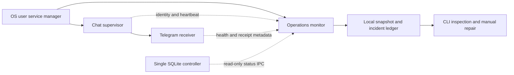

# Operational monitoring v1

The user authorized operational monitoring and process integration after reviewing
the [preparation](../implementation/CHAT_RELIABILITY_PREPARATION_2026-09-13.md).
This contract covers observation, local incident records and an independent
monitor process. The default is observation with manual recovery guidance.

## Responsibility boundary

The monitor observes major flow facts: reception availability, accepted work,
execution, result status and delivery. Workers retain their internal reasoning
and tool sequence. The monitor consumes facts through source adapters and does
not duplicate the workflow implementation or require an AI model.

Process identity and loop heartbeat establish liveness. Poll progress, controller
availability, AI recovery state and request outcomes establish different aspects
of readiness. A running process is not sufficient evidence of successful delivery.
An idle chat does not become unhealthy merely because it has no recent reply.

Telegram receipt and health adapters expose only bounded operational metadata.
No token, message text, source content or raw exception is included. Earlier
records missing newly introduced observations remain unknown rather than acquiring
invented timestamps or success claims. A bounded history sample is labelled as
partial; it is not a lifetime count.

## Process and persistence

The monitor runs independently of reception, the AI executor and the controller.
It reads their public host status and may issue the existing bounded, read-only
controller status request. It neither acquires the application's SQLite writer
lock nor starts another database writer or Telegram update consumer.

A separate private lock serializes monitor persistence and prevents duplicate
monitor processes. The latest snapshot and bounded incident transitions live in
private local files. Fixed diagnostic categories and recovery instructions are
retained without raw provider or OS error text. Repeated observations of the same
incident do not create an alert on every monitoring tick. Recovery is recorded
separately from acknowledgment or administrative stop.

Each diagnostic carries its own current evidence. An unreadable source opens a
fixed read/probe diagnostic and does not block unrelated observations. Unknown
evidence or disabled intent retains a previous unresolved incident; recovery
requires the corresponding positive observation. The snapshot's current
diagnostics and the ledger's unresolved diagnostics therefore have distinct uses.

The monitor has its own OS service identity, enabled intent and lifecycle.
Starting or stopping it does not start or stop the Telegram receiver, task worker,
controller, schedules or source permissions. Existing receiver recovery remains
owned by the existing chat supervisor. Explicit monitor stop survives subsequent
service-manager starts until the user enables it again.

macOS and Linux registration reuse the application's supported user-service
boundary. Platform support and actual native checks are reported separately.
Intervals, freshness windows and history limits derive from configuration and
existing bounded I/O budgets, not environment-specific constants.

## Alert and recovery boundary

The implemented alert sink is a durable local incident record with a CLI status
view and manual recovery guidance. Email, native desktop notifications and an
external missing-heartbeat service require a separately selected destination and
transport; storing an incident does not mean a person has been notified.

The monitor does not send Telegram messages, obtain credentials, execute arbitrary
commands, restart a stale chat supervisor, or replay interrupted work. A future
automatic recovery policy or interrupted-request notification must preserve
explicit stop intent, process identity checks and uncertain-delivery boundaries.

The local monitor cannot report a powered-off host or total host network failure
to an external user by itself. The local status view remains the repair entrypoint;
host-wide external detection is a separate optional integration.

## Completion evidence

Validate current and saved observation, bounded incident open/repeat/recovery,
quiet chat, disabled chat, missing controller, incomplete historical metadata,
foreground cancellation and duplicate monitor ownership. Verify OS render and
install/start/stop/remove in a separate private validation home before registering
the observation-only monitor on the current host. Do not interrupt the live bot
or perform fault injection against its real account.

Run existing relevant tests and affected build/vet checks. Do not create new test
source files. Record unperformed native or external-channel checks explicitly.
