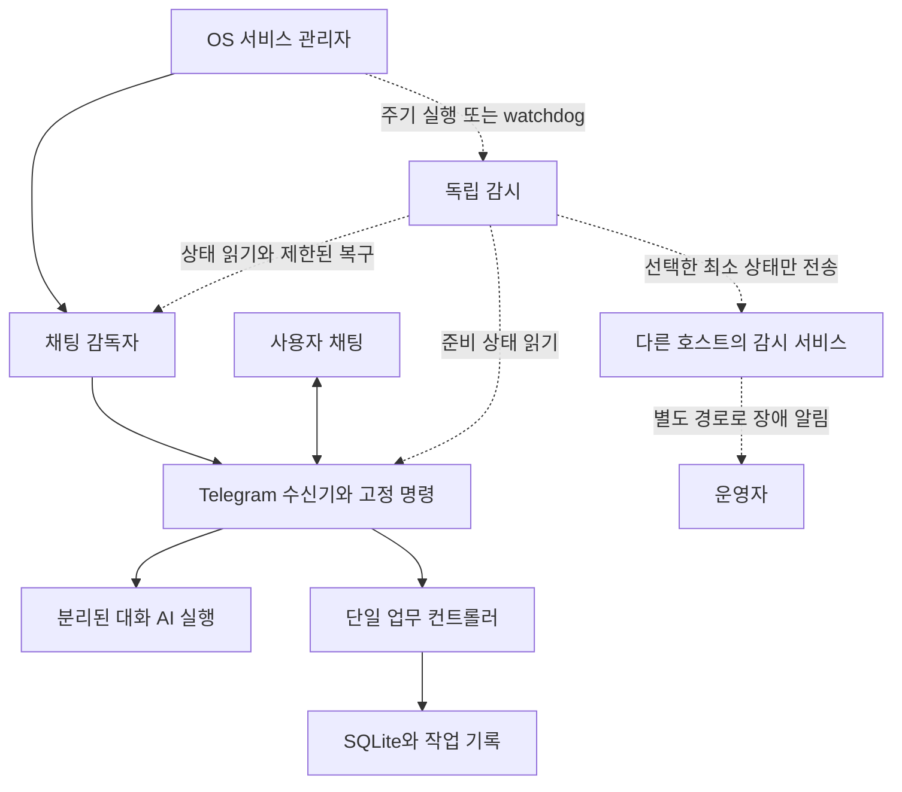

# 채팅 응답 유지와 감시 구성 준비 — 2026-09-13

상태: CHAT-OBS-00 준비 완료. 아래 개선안은 구현·운영 정책 검토용이며,
새 감시 프로세스 등록이나 외부 알림 설정을 완료했다는 뜻이 아니다.

사용자 요청은 채팅 프로세스 구성을 전체적으로 점검하고, 채팅 처리에 오류가
있어도 응답할 수 있도록 감시·복구 방식과 작업 순서를 준비하는 것이다.
현재 Mac을 첫 적용 대상으로 보고 기존 Linux 지원의 동등 검증을 뒤에 둔다.
[기존 운영 계약](../contracts/chat-operations-v1.md)과
[기존 구현·검증 기록](../validation/CHAT_OPERATIONS_2026-09-13.md)을 기준으로 한다.
구조 조사 기준은 `77544c5`와 아래 시각의 실행 상태다. 동시에 진행 중인 Telegram
접수 표시 변경의 실행 검증은 이 문서에 포함하지 않는다. 접수 표시가 문자나 반응으로
바뀌어도 생존·준비·최종 응답을 구분하는 감시 원칙은 동일하다.

## 1. 이번 Mac에서 실제 확인한 상태

2026-09-13 18:32–18:34 KST의 읽기 전용 확인 결과다.

| 확인 | 관찰 | 이 관찰로 알 수 없는 것 |
|---|---|---|
| `telegram status` | 페어링·enabled·supervisor_alive·receiver_alive 모두 true, poll connected | 모든 장애에서의 복구, 사람의 메시지 열람 |
| 실제 LaunchAgent 등록과 `launchctl print` | OS 서비스 running, RunAtLoad 활성, enabled 파일에 따른 KeepAlive PathState | 살아 있는 감독자의 내부 루프 정지 감지 |
| `errors` | 누적 오류 없음 | 앞으로도 오류가 발생하지 않는다는 보장 |
| receipt 상태 집계 | 페어링 1건, 일반 요청 completed 2건, 일반 요청의 접수 확인 sent 2건, 답변 메시지 ID 보존 | 사람의 수신 확인, 답변 품질 |
| 응답 관측 필드 대조 | AI 답변 완료 receipt가 있지만 LastReplyAt은 초기값 | 이 필드만으로 전체 답변 성공률을 판단할 수 없음 |

토큰, 대화 원문, 개인 식별자, 원본 런타임 파일은 이 문서에 옮기지 않았다.
서비스를 재시작하거나 메시지를 보내지 않았으며, 수신 update를 별도로 조회하지 않았다.
기존 [CHAT-06 인계 기록](CHAT_OPERATIONS_GOAL_2026-09-13.md#resume-chat-06)의
Keychain 중단 상태는 당시 환경의 기록이다. 이번 Mac은 이미 연결되어 있으므로
그 기록을 현재 Mac의 장애 진단으로 적용하지 않는다. 기존 인계 전체와 장애 검증을
이번 상태 조회만으로 완료 처리하지도 않는다.

## 2. 권장 구성

OS 서비스 관리자는 프로세스의 시작·종료를 맡고, 앱은 내부 루프 진행과 요청 결과를
관측한다. 호스트 자체가 꺼진 경우는 다른 호스트에서 관찰해야 한다.
점선은 추가 제안이고 실선은 현재 구조다.

사용자의 후속 정리: 감독자는 작업자의 내부 구성을 복제하지 않고 주요 흐름만
관측한다. 세부 수행 방식은 작업자가 소유한다. 맞춰야 할 것은 전체 구조가 아니라
주요 흐름에서 주고받는 관측 정보의 의미다.

감독 대상은 수신 가능 여부 → 접수 확정 → 실행 진행 → 결과 확정 → 전달 확인이다.
작업 내부의 도구 순서와 추론은 이 계약에 포함하지 않는다. 공통 관측값은 흐름·요청
식별자, 주요 상태, 마지막 실제 진행 시각, 완료·실패·불확실 구분과 복구 단서 정도로
제한한다. 작업자가 제공한 결과를 호스트가 검증한 사실과 Telegram의 전송 확인은
각각 해당 경계에서 기록한다. AI의 완료 선언이나 별도 타이머 heartbeat만으로
전체 흐름 완료를 인정하지 않는다. 정상 대기·재시도와 정체를 구분할 시간 기준은
사람이 관리하는 호스트 정책에서 정하며 AI가 임의로 기한을 연장하지 않는다.

업무를 배분하는 오케스트레이터와 생존·지연·알림을 다루는 운영 감시를 구분한다.
운영 감시에 여러 AI 감독자를 상시 배치할 필요는 없다. 기존 OS·감독자 계층 위에
독립된 작은 감시·알림 프로세스를 두고 공통 관측값으로 판단하는 구성이 우선이다.

macOS의 launchd는 KeepAlive로 종료된 서비스를 다시 실행할 수 있다.
현재 앱도 이를 사용한다. 이 등록만으로 살아 있는 프로세스 내부의 정지를
판별하는 것은 아니다. [Apple launchd 문서](https://developer.apple.com/library/archive/documentation/MacOSX/Conceptual/BPSystemStartup/Chapters/CreatingLaunchdJobs.html)

Linux에서는 현재 `Restart=on-failure`를 사용한다. 추가로 systemd의
`WatchdogSec`를 쓰려면 서비스가 `WATCHDOG=1`을 주기적으로 보내는 구현이
함께 필요하다. 신호는 실제 감독 루프의 진행에 연결해야 한다.
[systemd 공식 서비스 명세](https://github.com/systemd/systemd/blob/main/man/systemd.service.xml)

## 3. 이미 있는 장치와 보완할 부분

| 계층 | 현재 구현 | 준비할 보완 |
|---|---|---|
| OS → 감독자 | 감독자 종료 시 재실행, 명시적 중지 상태 보존 | 감독자가 살아 있지만 heartbeat가 멎은 경우의 독립 감시 |
| 감독자 → 수신기 | 프로세스 정체성 확인, 종료·event loop 정체 감지, 자식 정리 후 재시작 | OS·감독자·수신기 상태를 같은 상태 화면에서 구분 |
| Telegram 연결 | 제한 시간 있는 HTTP, polling 재시도, backoff와 retry_after, 중복 접수 억제 | 마지막 poll 성공과 현재 시도·대기 상태를 구분 |
| AI 처리 | 접수 확인 후 별도 실행, 제한 시간, 오류·panic의 고정 실패 안내 | 실제 접수·AI 답변·실패 안내 시각과 미완결 요청 관측 |
| 업무 컨트롤러 | 제한 시간 있는 IPC, 단일 SQLite 소유자 | 컨트롤러 장애와 채팅 응답 가능 상태를 구분해 계속 표시 |
| 중단 요청 | 재실행하지 않고 interrupted와 오류 기록 보존 | 복구 후 별도 고정 안내를 보낼지 전달 정책 결정 |
| 호스트 전체 | 로컬 상태·오류 확인 | 다른 호스트의 감시와 별도 알림 경로는 선택 후 연결 |

AI 오류가 나도 `/help`, `/errors` 등은 AI 없이 처리한다. `/status`도 컨트롤러
연결 실패 시 `controller_available=false`와 복구 안내를 반환하는 구현이 있다.
컨트롤러 오류가 곧 전체 채팅 무응답이라는 진단은 맞지 않는다.

반면 수신기 생존 판정은 프로세스 정체성과 event loop heartbeat를 뜻한다.
Telegram 연결, AI 준비, 업무 컨트롤러 준비, 답변 전송의 성공은 별도 사실이다.
현재 LastReplyAt은 고정 응답 경로에서만 갱신되고 AI 답변에서는 갱신되지 않는다.
이를 전체 응답 감시 지표로 쓰기 전에 의미와 갱신 경로를 정리해야 한다.

소스 저장소의 관련 구현은 `internal/chatsupervisor/supervisor.go`,
`internal/telegramchat/receiver.go`, `internal/telegram/health.go`,
`internal/telegram/client.go`, `internal/reception/commands.go`,
`internal/reception/host.go`, `internal/service/service.go`,
`internal/service/linux.go`에 있다. 배포 패키지의 안내 문서에는 Go 소스가 포함되지 않는다.

## 4. 평소 무엇을 관찰할 것인가

운영 화면은 다음 사실을 따로 보여 주는 방향을 제안한다. 이름은 의미 설명이며
새 필드명이나 외부 API를 확정하는 계약은 아니다.

| 관측 영역 | 필요한 정보 | 판단 원칙 |
|---|---|---|
| 등록·의도 | OS 등록, enabled/명시적 중지, 마지막 감시 시각 | 사용자가 중지한 상태는 장애로 재시작하지 않음 |
| 프로세스 | 감독자·수신기 정체성, heartbeat 경과, 재시작 횟수 | PID 존재와 내부 루프 진행을 함께 확인 |
| 수신 | 마지막 poll 성공, 현재 연결·대기 이유, 다음 허용 재시도 시각 | 정상 long poll과 제공자 retry_after를 정체로 오판하지 않음 |
| 사용자 응답 | 접수 확인 지연, 답변 또는 실패 안내 지연, 전송 불확실 건수 | 정상 답변과 오류 안내를 구분하고, 메시지가 없는 시간은 정상으로 취급 |
| 실행 | AI 준비·복구 필요, 현재 요청 경과, 컨트롤러 응답, 큐 대기 | AI가 불가해도 고정 응답이 가능한 상태를 표시 |
| 운영 여유 | 오류 발생·재발, 미저장 오류, 디스크 여유, 작업 적체 | 단일 실패마다 알리지 않고 지속·반복·사용자 영향 기준으로 집계 |

요청 receipt의 현재 At은 상태 변경 때 덮어쓰므로 단계별 지연을 재구성할 수 없다.
후속 구현은 원문 없이 단계별 시각과 결과를 보존하고, 기존 receipt의 없는 값은
unknown으로 취급해야 한다. 과거 수치를 임의로 채우지 않는다.

Google SRE도 내부 지표와 외부에서 본 증상을 함께 관찰하고 지연·요청량·오류·자원
포화를 주요 신호로 다룬다. 이 앱에는 위처럼 채팅과 작업 단계에 맞춰 적용하는 편이
적절하다. 초기에는 CLI와 구조화된 상태로 시작하고, 운영 규모가 필요로 할 때
별도 시계열 수집·대시보드를 연결한다.
[Google SRE 모니터링 원칙](https://sre.google/sre-book/monitoring-distributed-systems/)

## 5. 오류 상황별 응답·복구 제안

| 상황 | 사용자에게 보일 결과 | 복구 주체 |
|---|---|---|
| AI가 오류를 반환하거나 제한 시간에 종료 | 실패 안내와 오류 ID, 고정 명령 유지 | 수신기, 현재 기본 동작 유지 |
| 업무 컨트롤러 연결 실패 | 채팅 상태와 업무 처리 불가 사유 | 수신기의 고정 응답, 소유한 컨트롤러만 복구 |
| 수신기 종료·루프 정체 | 복구 뒤 새 요청 수신 가능 | 기존 감독자 |
| 감독자의 내부 루프 정체 | 감독자 복구 뒤 수신 재개 | 제안한 독립 감시 또는 OS watchdog |
| 접수 뒤 프로세스 중단 | 기존 요청의 완료 여부를 확인할 수 없다는 안내 후보 | 전달 정책 채택 후, 중복 억제된 복구 안내 |
| Telegram 전송 결과 불확실 | 해당 전송을 불확실로 남김 | 자동 재전송·업무 재실행 없음 |
| 호스트 전원·절전·네트워크·Telegram 자체 장애 | 같은 채팅의 즉시 답변을 보장할 수 없음 | 다른 호스트의 감시와 독립 알림 경로 |

복구 안내는 원 작업의 재실행도, 불확실했던 답장의 재전송도 아니다.
채택한다면 안내 자체의 보내기 전 상태·전송 확인·불확실 상태와 중복 키를 보존하고,
반복 재시작 시 안내가 누적되지 않게 한다. 오래된 요청의 일괄 안내는 별도 대상으로
두며 알림 대상 기간·집계 방식을 정해야 한다.

## 6. 감시 등록과 외부 관찰의 경계

현재 Mac의 OS 등록은 끝나 있다. 추가할 것은 별도 주기로 실행되는 작은 감시
프로그램의 구성안이다. 이 프로그램은 enabled 의도, 감독자의 정체성과 heartbeat,
등록 상태를 확인하고 허용된 복구만 요청한다. 수신기는 계속 기존 감독자 하나가
관리하며, 감시기가 두 번째 `getUpdates` 수신기나 SQLite 작성자가 되지 않는다.

감시 주기·정체 기준·복구 유예·반복 복구 대기 시간을 각각 설정값으로 둔다.
현재 `HealthInterval`과 `StallTimeout`, HTTP·IPC 상한, 최대 분할 전송,
시작·정리 시간에서 기본값을 도출한다. 운영 경보 기준과 프로세스 강제 복구 기준을
같은 값으로 처리하지 않는다. Telegram 제공자의 재시도 대기는 존중하고,
제공자 장애만으로 프로세스를 계속 재시작하지 않는다.

외부 감시를 선택하면 새 공개 수신 포트 없이 최소 상태를 외부에 주기적으로
보내는 방식을 우선 검토한다. 외부는 신호 누락 또는 관측된 준비 상태 저하를
알린다. 감시 프로그램이 실행되었다는 이유만으로 정상 신호를 보내면 안 된다.
명시적 중지·점검 모드, 장애 중복 억제, 복구 통지를 포함한다.

외부 신호의 성공은 실제 Telegram 왕복 응답 성공과 다르다. 실제 사용자 관점의
검증은 허용된 별도 점검 경로를 정해야 한다. 처음에는 본인이 `/status`와 일반
질문을 보내 결과를 확인하는 수동 점검을 사용한다. 외부 봇이 같은 토큰으로
`getUpdates`를 호출해 운영 수신을 빼앗는 방식은 사용하지 않는다.

호스트 자체나 Telegram이 끊겼을 때도 알림을 받으려면 동일한 호스트·채널에
의존하지 않는 알림 수신처가 필요하다. 외부 서비스, 주소, 자격 증명, 알림 수신처는
아직 정하지 않았다. Slack은 현재 안내 자료만 있으며 수신 어댑터 구현과 검증은
이 준비의 범위를 넘는다.

### 보조 알림 창구 권고와 수동 복구

사용자는 채팅 장애를 알림으로 전달받은 뒤 직접 호스트에 접속해 확인·재시작하는
운영을 고려하고 있다. 알림을 받는 창구와 실제 복구 명령을 실행하는 경로를 구분한다.
권고는 이메일을 채팅 밖의 보조 알림 창구로, macOS 알림을 현장 보조 수단으로 쓰는
것이다. 이는 후보 제안이며 수신 주소나 발신 권한을 선택·설정한 상태가 아니다.

| 창구 | 적합한 상황 | 의존성과 한계 |
|---|---|---|
| 이메일 | Mac 밖에서도 Telegram 장애를 전달받고 나중에 직접 접속 | 발신 설정 필요, 전송 지연·스팸 가능; 같은 Mac의 발신기는 전원·전체 네트워크 장애 때 발신 불가 |
| macOS 알림 | 추가 외부 서비스 없이 현재 Mac에서 장애를 확인 | 알림 권한과 표시 설정 필요; Mac 앞에 없거나 호스트가 꺼지면 원격 통지 수단이 되지 않음 |
| 같은 Telegram 봇의 독립 발신 | 수신기만 실패하고 API·토큰·네트워크는 정상 | 다른 수신 채널은 아니며 Telegram 전체 장애를 우회하지 못함 |

macOS는 앱의 로컬 알림을 지원하며 사용자 알림 설정에 따른다.
[Apple 로컬 알림](https://developer.apple.com/documentation/UserNotifications/scheduling-a-notification-locally-from-your-app),
[알림 권한](https://developer.apple.com/documentation/usernotifications/asking-permission-to-use-notifications)

같은 봇의 단방향 알림은 `sendMessage`만 사용하는 별도 호스트 경로로 검토할 수
있다. 두 번째 `getUpdates` 소비자를 만들지 않는다. 실제 구현 시 기존 발신과의
요청 속도 제한, 오류 집계, 알림 중복 억제, 비밀 접근 범위를 함께 정해야 한다.
[Telegram 송신 API](https://core.telegram.org/bots/api#sendmessage)

이메일 발신은 기존 Gmail 읽기 전용 커넥터의 권한에서 자동으로 허용되는 작업이
아니다. 별도의 제한된 발신 설정이 필요하다. 알림에는 호스트 별칭, 영향을 받은
주요 흐름, 마지막 정상 시각, 자동 복구 결과, 상태 확인 방법만 담고 대화 원문은
담지 않는다. 단일 일시 오류보다 복구 실패나 지속 장애를 알리며 같은 장애는 집계한다.

사용자는 알림을 보고 로컬 터미널 또는 이미 허용된 SSH로 접속해 `telegram status`와
`errors`를 확인하고 필요하면 `telegram restart`를 실행한다. 알림을 보내는 기능이
새 원격 제어 채널이나 임의 명령 실행 권한을 만들지는 않는다.

외부 시스템을 최소화하려면 현재 Mac의 독립 감시와 macOS 알림까지만 먼저 구성할
수 있다. 호스트 자체의 정지를 Mac 밖에서 자동으로 알려면 외부에서 신호 누락을
관측해야 한다. 그 필요가 생겼을 때 작은 외부 감시를 연결하고 이메일로 전달한다.
예를 들어 외부 감시 서비스는 상태 변화와 이메일 등 복수 알림 채널을 지원한다.
[외부 감시의 알림 구성 예](https://healthchecks.io/docs/configuring_notifications/)
특정 서비스 가입·설치나 상시 외부 감시는 이번 방향의 필수 조건이 아니다.

## 7. 작업 단위와 완료 증거

| ID | 작업 | 완료 증거 | 상태 |
|---|---|---|---|
| CHAT-OBS-00 | 현재 상태·구조·공식 운영 방식 조사와 구성안 | 이 문서, 읽기 전용 상태와 실제 OS 등록 확인 | 준비 완료 |
| CHAT-OBS-01 | 생존·준비·요청 결과를 구분하는 관측값과 상태 표시 | 일반 AI 답변·고정 응답 모두 전송 시각 반영, 조용한 정상 상태·연결 대기·AI 불가·컨트롤러 불가 구분 | 제안 |
| CHAT-OBS-02 | macOS 독립 감독자 감시와 기존 수신 복구의 통합 | 감독자 정체에서 복구, 명시적 중지 유지, 중복 등록·중복 수신 없음; Linux watchdog은 별도 native 검증 | 제안, 등록·복구 정책 확인 필요 |
| CHAT-OBS-03 | 중단 요청 안내의 전달 계약과 구현 | 채택한 경우 원 작업 재실행 없이 안내 1회, 안내 전송 불확실도 보존, 반복 재시작 시 중복 없음 | 제안, 사용자 전달 정책 결정 필요 |
| CHAT-OBS-04 | 오류·정체 상황의 실제 동작 점검 | AI 오류·제한 시간·연결 끊김·종료·정체·stop 이후 정상 응답/상태 확인; 정상 long poll·retry_after 오탐 없음 | 제안 |
| CHAT-OBS-05 | 필요 시 다른 호스트 감시·알림 연결 | 호스트 신호 누락 감지, 다른 경로의 장애·복구 통지, 점검 모드와 최소 정보 전송 | 선택 사항, 운영 대상·알림 수신처 결정 필요 |

먼저 OBS-01로 관측을 정확히 하고 OBS-02로 독립 감시를 붙인다. OBS-03은
전달 정책 결정 후 진행한다. OBS-04의 검증은 각 변경에 붙여 수행하고 마지막에
한 번의 운영 흐름으로 연결한다. OBS-05는 실제 운영 호스트와 알림 경로 선택 후다.

현재 Telegram HTTP는 30초 상한, 전송은 최대 3개 분할, 컨트롤러 호출도 제한 시간을
둔다. 취소를 무시하는 AI나 비정상 poll 종료는 실제 운영에서 확인된 결함이 아니라
강건성 점검 시나리오다. 해당 검증에서 필요성이 드러날 때만 별도 deadline 소유권,
늦은 결과 차단, poll 종료 감시 같은 변경을 작게 나눠 추가한다.

실제 운영 봇을 죽여 검증하지 않는다. 기존 합성 검증 환경 또는 분리된 데이터 홈에서
장애를 먼저 재현하고, 실제 봇에서는 승인된 전환과 본인의 메시지로 연결을 확인한다.
새 테스트 코드는 사용자 요청이 있을 때만 작성하고 기존 관련 검사를 재사용한다.

## 8. 이번 준비에서 수행한 검증과 남은 결정

수행: 관련 소스·계약·작업 기록 대조, 실제 앱 상태와 launchd 등록 조회,
원문 없는 receipt 집계, 공식 launchd/systemd/SRE 자료 확인, 문서 링크·공백 검사.
코드 변경·런타임 테스트·장애 주입·프로세스 재시작·감시 등록·외부 알림은 수행하지 않았다.

구현 전 확인할 범위는 독립 감시의 등록·복구 정책과 중단 요청 안내 방식이다.
상시 서버로 옮기거나 외부 알림을 붙일 때는 운영 호스트와 알림 수신처를 정한다.
기존 Skill, 작업 권한, SQLite 단일 작성자, 중복·불확실 전달 정책은 유지한다.
