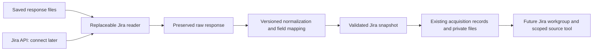

# Jira ingestion preparation

Date: 2026-09-06.

Status: the user approved implementing the collection, Jira-specific internal
format and raw/normalized preservation boundary below. Real account connection
and AI reporting are deferred. Cloud/Data Center selection remains unresolved;
the selected live HTTP transport is a later dependent unit. This approval is
not authorization for a live Jira connection. The saved-input units below are
now implemented; the [actual checkpoint](../validation/PHASE_06_JIRA_INGESTION.md)
and [terminal guide](../setup/JIRA_INGESTION.md) record their supported scope.

## Intended result

Prepare the collection path so a selected Jira connection can later supply data
without changing how Chun-su stores and interprets normalized Jira evidence.
The interchangeable boundary includes both provider reads and response mapping.
It must work with saved synthetic responses before using an account.

The first deliverable is a validated, traceable Jira input bundle. Jira AI
reporting, workload judgments and live account activation are distinct later
steps. Collection preparation does not complete Phase 6 or the remaining mail
usefulness milestone.

## What the current code can reuse

| Existing component | Reuse or required seam |
|---|---|
| `internal/store/acquisition.go` | Generic checkpoint IDs, parent links, hashes, timestamps and immutable payload files can store Jira acquisition evidence |
| `internal/files/` | Private paths, size bounds, immutable writes and integrity checks |
| `internal/secrets/` | Host secret references once an authentication mode is chosen; no Jira token is needed for saved-response preparation |
| `internal/config/` | Existing operational limits; add only Jira-specific limits that cannot be represented without changing mail semantics |
| `internal/workgroup/`, `internal/runner/`, `internal/gateway/` | Currently interpret mail snapshots and Gmail bindings; Jira reporting needs an explicit workgroup dispatch seam later |
| `internal/cli/gmail.go` | Its acquisition listing currently reads all acquisition records; a Jira record requires provider-aware filtering |
| `internal/backup/backup.go` | Acquisition files are already covered, but connection restore assumes Gmail under `state/connections`; a Jira connection must not break restoration |

The store already accepts a workgroup name, but that does not make the entire
execution path provider-neutral. Keep Jira fields in a Jira model. The future
workgroup dispatch shares the job/attempt/artifact lifecycle and selects the
appropriate validator, package builder and source reader.

## Boundaries to implement

### Reader: obtain evidence

A small internal reader interface now performs bounded issue-page reads from
saved responses. Identity and context reads belong to the later selected HTTP
provider; embedded context can already be normalized. Inputs contain the selected connection,
approved scope and an opaque continuation. Outputs contain response bytes,
provider/format identity, collection timestamps, continuation metadata and safe
error classification. The interface has no write operation or arbitrary URL.

Implement a saved-response reader first. A disconnected live reader returns an
explicit `not_configured` result before opening a network connection or reading
Keychain. It must never return an empty successful collection as a substitute.
The selected HTTP implementation then replaces this reader without changing
the normalizer or acquisition controller.

The reader owns API paths, authentication, request serialization and pagination
mechanics. A provider continuation is data for that reader, not a caller-selected
URL. Authentication is attached only to configured service routes; source links
and redirects do not expand those routes.

### Normalizer: map provider data to Jira evidence

Make normalization deterministic and free of network/credential access. Its
inputs are preserved response bytes, a versioned provider format, explicit
field mappings and acquisition context. Its output contains normalized facts,
provenance and field-level limitations. A mapping change creates a new derived
snapshot from the preserved response; it does not rewrite previous evidence.

Provider field names, status mappings, identity conventions, rich-text formats
and sprint/estimate custom fields stop at this boundary. Field mappings are
configuration, not guessed IDs or names inside the collector. Missing mappings
remain explicit; unrecognized fields cannot silently become zero or false.

### Collector: validate scope and preserve progress

The host pins scope, field mappings, reader/normalizer versions and limits for
one acquisition chain. It writes raw evidence before publishing checkpoint
references, validates normalized data, and records completeness separately
from successful retrieval of an individual page.

Reuse the existing SQLite acquisition index and keep payload files under its
existing private acquisition directory. The intended first implementation
requires no database migration. The payload needs a provider discriminator so
CLI listing and later consumers can identify the proper parser. Legacy Gmail
payloads retain their existing interpretation.

Unfinished retrieval, expired cursors, normalization errors and successful empty
results must remain different outcomes. Resume uses the pinned scope/mapping;
changing either starts a new chain. No report coverage is recorded merely
because data was collected.

## Proposed Jira snapshot contract

The user approved the responsibility and meaning of these field groups as the
basis for the first persisted contract. Implementation will document concrete
names and versions. Optional fields carry explicit availability and provenance.

| Field group | Meaning |
|---|---|
| Envelope | Version, provider format, acquisition/connection IDs, synthetic flag, requested timezone, collection start/end and scope/mapping digests |
| Subject identity | Provider-native stable user ID and optional display name; unknown identity stays unknown |
| Scope | Allowed projects, selected board/sprint, assigned-work selection, explicit related-issue allowance and page/issue/history limits |
| Issue identity | Provider issue ID namespaced by connection, current issue key and project ID/key; key/name changes do not create a new identity |
| Current facts | Summary, normalized description, raw status ID/name, mapped status category when known, assignee and resolution evidence |
| Sprint membership | Sprint/board references and available dates/state; membership and assignment are separate facts |
| Estimates | Available original/remaining time and story points with their units; missing values are null/unknown, never zero; no automatic points-to-hours conversion |
| Dates | Source created/updated/resolved timestamps and date-only due dates with declared interpretation; no invented midnight or timezone |
| Relationships | Related issue IDs, link types/direction and whether context was actually obtained within scope |
| History | Retrieved comments/changelog entries with stable IDs, source times and explicit coverage; uncollected history is not an empty complete history |
| Provenance | Raw response reference/hash, record location within that response and normalizer/mapping versions |
| Completeness | Page coverage, omitted/denied/unavailable fields and relationships, truncation and temporal-consistency limitations |

Jira collection observes mutable state over an interval. A request timestamp or
an `updated` filter alone does not reconstruct a historical state. Preserve
source update times and collection start/end; label records changed during
collection or unavailable history rather than claiming one atomic past view.

Do not calculate delay, post-completion action or capacity in this layer. Those
are versioned report judgments. In particular, another person's sprint issue
is not the user's workload, a later comment is not proof of new work, and a
ticket count is not effort or availability.

## Provider and connection selection

Cloud versus a company-operated installation remains unanswered. The neutral
reader boundary can be approved now; its live transport cannot honestly be
called ready for an unspecified deployment/authentication mode.

| Configuration belongs outside the normalizer | Deferred until connection preparation |
|---|---|
| Provider profile | Cloud or the deployed Data Center version |
| Service identity | Base URL, site/cloud ID where required, expected authenticated user |
| Credentials | Selected authentication mode and host secret reference; no values in config, packages, source records or command arguments |
| Access policy | Allowed projects, board/sprint selection, assigned-work and related-context limits |
| Field mappings | Actual sprint/estimate field IDs and supported response shapes |
| Activation | Disabled until explicitly connected and checked; saving a draft profile makes no request |

Once the provider profile is selected, implement and validate its HTTP request
and response adapter with saved responses and a controlled fake transport. Real
login, tenant metadata discovery and provider behavior remain unverified until
the user chooses to connect. A token with broader provider permissions does not
create write tools in the host reader or executor gateway.

## Work units and completion evidence

| Unit | Deliverable | Evidence before claiming that unit complete |
|---|---|---|
| P6-01a | Reviewed ingestion boundaries and snapshot meanings | Concrete scope, unresolved provider choice, reuse points and completion criteria recorded |
| P6-02a | Reader interface, saved-response reader, disconnected live state | Saved data can be obtained without secrets/network; disconnected mode reports `not_configured` |
| P6-03a | Jira normalizer and configurable field mapping | Synthetic normal/empty/partial inputs, missing fields, changed field mappings and unavailable history retain truthful facts and provenance |
| P6-03b | Persistent acquisition bundle and inspection commands | Raw-to-normalized links/hash checks, bounded duplicate handling and separate resume checkpoints; Gmail acquisition listing remains correct |
| P6-02b | Selected HTTP provider implementation, inactive by default | Reviewed read-only request allowlist, bounded pagination/retries, redirect refusal and auth-error states through a controlled transport; no claim of real tenant verification |
| P6-03c | Cross-provider storage integration review | Relevant existing Gmail collection inspection and backup/restore behavior still work with the new record type |
| P6-04 onward | Jira guide, result schema, scoped tools and common execution dispatch | Separate reviewed implementation step; actual Jira source/tool boundary and report evaluation evidence |

Implemented terminal surface: `jira status`, `inspect`, `collect`, `resume`,
`renormalize`, `acquisitions`, `show` and `source`. Collection performs
normalization and preservation together. Status reports the disconnected live
reader without creating a connection draft. Exact command and JSON meanings
are documented in the [evidence contract](../contracts/jira-evidence.md).

Use meaningful existing checks and manual synthetic fixtures; do not add test
code unless the user asks. New persistent/CLI contracts and changes needed in
backup/connection handling must be reviewed before dependent edits. Keep local
commits bounded by these units, and preserve the user's unrelated changes.

## Readiness evidence before implementation

Actually done: read the current code and Phase 6 plan, traced mail-specific
assumptions in packaging/execution/gateway/listing/restore, and checked current
official API references. The Cloud search reference identifies the enhanced
`search/jql` endpoint with token continuation while the older search endpoint
is being removed. The chosen transport must use the current endpoint for its
deployment. [Cloud issue search](https://developer.atlassian.com/cloud/jira/platform/rest/v3/api-group-issue-search/).

Cloud v3 supports ADF for descriptions/comments, and Software sprint/estimate
fields require field identification; these are reasons to isolate format and
field mapping. [Cloud v3 introduction](https://developer.atlassian.com/cloud/jira/platform/rest/v3/intro/),
[Software field formats](https://developer.atlassian.com/cloud/jira/software/rest/).

Data Center has a separately versioned REST reference. Its deployed version and
authentication still need verification; the documentation renderer returned
only navigation for the selected search page, so its detailed route contract
was not established in this preparation. [Data Center reference](https://developer.atlassian.com/server/jira/platform/rest-apis/).

At proposal time, Jira runtime code and validation had not been implemented.
The subsequent approved work added saved readers, normalization, private
acquisitions and inspection commands, with no schema migration. Credentials,
tenant requests, AI Jira execution and live validation remain deferred; no test
code was generated. Existing mail runtime configuration, active workgroup and
private reports were not changed. See the [implementation checkpoint](../validation/PHASE_06_JIRA_INGESTION.md)
for the evidence after this preparation review.
