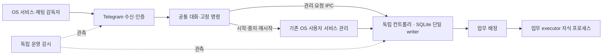

# 채팅과 내부 실행을 따로 복구하기

외부 수신과 공통 대화·고정 명령은 원격 관리의 앞단이다. Telegram 수신기가
컨트롤러를 자식으로 소유하지 않는다. 기존 채팅 감독자는 이 앞단을 복구하고,
독립 컨트롤러는 자기 OS 사용자 서비스로 실행된다. 업무 실행은 컨트롤러 내부의
배정 기능과 기존 executor 자식 프로세스로 구성하며 SQLite writer를 추가하지 않는다.



Slack 등 새 어댑터는 인증된 메시지를 같은 공통 접수 계층에 넘기는 구조다.
이 변경에 Slack 연결 구현은 포함되지 않는다.

## 원격 채팅에서 복구

1. `/status`로 수신과 컨트롤러 상태를 확인한다.
2. 컨트롤러가 없으면 `/controller start`를 보낸다. task AI 설정이 없어도
   관리 서비스는 시작할 수 있다.
3. task 실행기 설정이 준비되었으면 `/worker start`로 새 업무 배정을 켠다.
   설정 검증에 실패하면 이유를 답하고 컨트롤러와 채팅을 유지한다.
4. `/worker status`로 업무 배정 상태를 확인한다. 큐가 paused이면 시작만으로
   재개되지 않으며 `/resume`은 별도의 명시적 조작이다.

`/worker stop`은 새 업무 배정을 멈추며 이미 진행 중인 업무는 마칠 수 있다.
`/worker restart`는 유휴 상태에서 설정을 다시 검사해 업무 배정을 준비한다.
`/controller stop`과 `/controller restart`는 진행 중인 업무나 설정 인증 작업이
있으면 거부한다. 완료 상태를 확인하거나 기존 취소 명령으로 정리한 뒤 다시 시도한다.
중지·재시작이 불확실하면 `/status`, `/jobs`, `/errors`로 확인한다.

고정 명령에는 AI가 필요하지 않다. 일반 AI 대화는 reception route가 필요하지만
백엔드가 없어도 답변 생성은 가능하다. 컨트롤러가 필요한 업무 요청은 복구 안내를
반환한다. 지연만으로 추가 메시지를 보내지 않고 실제 오류·중단을 구분해 안내한다.

## 로컬 또는 SSH에서 같은 조작

동일한 데이터 홈과 사용자 계정에서 실행한다. 별도 홈은 모든 명령에 같은
`--home <private-directory>`를 지정한다. 명령의 slash만 제거하면 같은 관리 경로다.

```sh
chunsu controller status
chunsu controller start
chunsu worker start
chunsu worker status
chunsu worker stop
chunsu controller restart
chunsu controller stop
```

`controller serve`는 터미널에서 직접 소유하는 실행 방식이다. 이 foreground 실행이나
기존 `worker`, `setup serve`를 OS 서비스 명령으로 강제 교체하지 않는다. 실행한
터미널에서 정상 종료하고 관리 서비스로 전환한다. 동일 데이터 홈에 두 writer를
실행하지 않는다.

실행기 설정을 변경하는 기존 CLI는 데이터 writer 잠금이 필요하다. 유휴 컨트롤러를
`controller stop`으로 내리고 기존 `config route` 명령으로 승인된 계정·실행 경로를
설정한 뒤 다시 시작한다. 이 기능은 계정이나 모델을 자동 선택하지 않는다.

## 재시작과 관측

채팅만 재시작하려면 `telegram restart`, 백엔드만 재시작하려면 `controller restart`,
감시기만 재시작하려면 `monitor restart`를 사용한다. 업데이트 때는 실행 중 업무를
먼저 확인하고 변경된 구성요소를 재시작한다. 전체 재시작 전용 강제 명령은 제공하지
않는다. 이전 receiver-owned 구조에서 처음 전환할 때는 기존 채팅을 먼저 멈춘 뒤
새 바이너리로 컨트롤러와 채팅을 차례로 시작해 소유권 경쟁을 피한다.

`monitor check`의 `frontend_health`와 `backend_health`는 별개다. 업무 설정이
없어도 앞단이 ready일 수 있고, 명시적으로 중지한 뒷단은 disabled다.
감시기는 관측·로컬 경보만 기록한다. 채팅 장애 시 알림을 다른 곳으로 전달하는
외부 채널은 아직 설정하지 않았다. 로컬/SSH에서 진단·복구할 수 있으며 호스트 전원·
전체 네트워크 장애를 관찰하려면 별도 호스트가 필요하다.

macOS 서비스는 로그인 사용자 세션에서, Linux 서비스는 준비된 사용자 서비스
관리자에서 실행된다. 명시적 중지는 실행 의도에 남으며 과거 worker 마커로
되살리지 않는다. 불확실한 업무·응답을 자동 재실행하거나 재전송하지 않는다.
